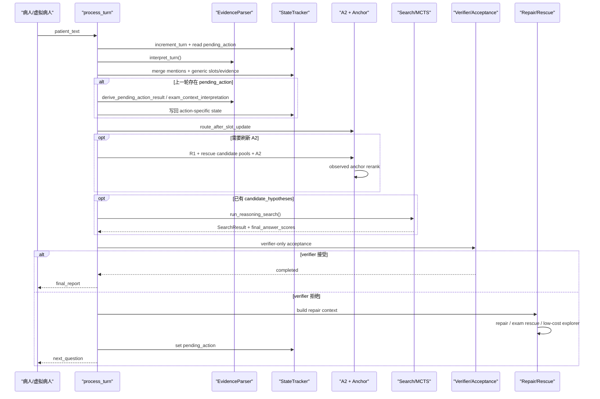

# brain 运行链路详解

本文说明的是 2026-05-05 当前版本里，[`brain/service.py`](../brain/service.py) 的真实单轮运行链路。

它回答的问题是：

- 病人说一句话之后，系统先做什么、后做什么
- `A1 / A2 / A3` 现在分别还承担什么职责
- `MCTS / rollout / verifier / repair / anchor` 是怎么串起来的
- 为什么当前文档已经不能再按“`A1 / A2 / A3 / A4 + stop rule`”的旧口径理解

## 0. 先给当前版本下一个准确结论

当前系统的主链不是旧版的：

- `A1 -> A2 -> A3 -> A4 -> stop rule`

而是：

- `turn_interpreter`
- `generic state merge`
- `pending action interpretation`
- `route`
- `A1 / A2 / A3`
- `verifier-only acceptance`
- `repair / rescue / explorer`
- `next question or final report`

更具体地说，当前系统有下面几个关键变化：

1. `A4` 已经不是当前对外主阶段名
2. 结构化 `stop rule` 已从主链路移除
3. `completed` 现在只由 verifier 或 observed final evaluator 的接受信号触发
4. `StopDecision` 这个数据结构还在，但它现在主要只是“接受结果 / 阶段性停止结果”的载体，不再代表旧版那套 stop-rule 引擎
5. `MCTS` 仍然负责搜索，但搜索前后的状态构建、候选重排、最终接受与 repair 已经发生了明显算法演化

## 1. 当前应该怎样理解几个术语

### 1.1 `A1 / A2 / A3`

- `A1`：从本轮统一解释结果里生成首轮检索视图 `key_features`
- `A2`：基于 `R1` 检索候选疾病，并结合 observed anchor 做候选重排
- `A3`：围绕当前候选疾病做 `R2 -> 动作构造 -> MCTS / rollout -> 选下一问`

### 1.2 `pending action interpretation`

它不是独立阶段，而是每轮正式进入 `A1 / A2 / A3` 前的一层统一“回答消化器”。

它负责回答：

- 这句患者输入是不是在回答上一轮系统发出的那个问题
- 如果是，它对应的 `polarity / resolution / exam_context / evidence_state` 是什么

### 1.3 `anchor`

`anchor` 也不是单独阶段，而是横切层：

- 会参与 `A2` 候选重排
- 会参与 `TrajectoryEvaluator` 的答案评分
- 会参与 verifier 拒停后的 repair 决策

当前的 observed anchor 只认真实会话状态里的：

- `slots`
- `evidence_states`

它不会把 rollout / simulation 里的模拟阳性当作真实锚点。

### 1.4 `verifier-only acceptance`

当前是否 `completed`，不再由结构化 stop-rule 阈值控制，而是由：

- [`brain/acceptance_controller.py`](../brain/acceptance_controller.py)

里的 [`VerifierAcceptanceController`](../brain/acceptance_controller.py) 决定。

它只消费：

- `llm_verifier`
- `observed_evidence_final_evaluator`

的接受或拒绝信号。

## 2. 对外入口没有变，但内部编排变了

对外部调用者来说，核心接口仍然是：

1. `brain.start_session(session_id)`
2. `brain.process_turn(session_id, patient_text)`

真正的单轮处理入口仍然收敛到：

- [`ConsultationBrain.process_turn()`](../brain/service.py)

外层调用者通常包括：

- Streamlit 实时前端
- 命令行 demo
- replay / 虚拟病人自动对战

其中 replay 的单轮外层一般是：

1. 虚拟病人给出 opening
2. `brain.process_turn(session_id, opening_text)`
3. 系统返回 `next_question`
4. 虚拟病人回答该问题
5. 再次 `brain.process_turn(...)`

## 3. 当前运行链路最重要的几处算法变化

### 3.1 当前主入口不是 `MedExtractor`，而是 `turn_interpreter`

虽然默认依赖里仍会构造 `MedExtractor`，但 `process_turn()` 主链当前真正先调用的是：

- `EvidenceParser.interpret_turn(patient_text, pending_action=...)`

也就是说，当前单轮主链已经变成：

- 先统一抽 `mentions`
- 再由同一份 `mentions` 派生：
  - `PatientContext`
  - `A1ExtractionResult`
  - `pending_action_result`
  - `mention_context`

而不是像早期那样让多套解释器分别重复解析同一句话。

### 3.2 `A2` 已不是“只看 R1 top-k”

当前 [`_run_a2()`](../brain/service.py) 会先做：

- `retrieve_r1_candidates(...)`
- `retrieve_observed_anchor_candidates(...)`
- `retrieve_scope_sibling_candidates(...)`
- `_merge_hypothesis_candidate_pools(...)`

再进入：

- `HypothesisManager.run_a2_hypothesis_generation(...)`

最后还会再做一次：

- observed anchor rerank

所以现在的 `A2` 已经不是“R1 检索完直接排个序”，而是：

- `R1 原始候选`
- `observed anchor rescue`
- `scope sibling rescue`
- `LLM / 规则 A2 排序`
- `observed anchor 二次重排`

### 3.3 `A3` 后面不是旧 `A4`，而是 `trajectory aggregation + verifier + repair`

当前 [`run_reasoning_search()`](../brain/service.py) 在 `A3` 内部完成的是：

- `select_leaf`
- `expand_node`
- `rollout_from_tree_node`
- `backpropagate`
- `trajectory group scoring`
- `best answer selection`
- `root action selection`

搜索结束后，系统不会进入旧版 `A4` 阶段名，而是进入：

- `TrajectoryEvaluator.score_groups(...)`
- `VerifierAcceptanceController.should_accept_final_answer(...)`
- `_build_verifier_repair_context(...)`
- `_choose_repair_action(...)`

### 3.4 结构化 `stop rule` 已移除

当前 README 里的口径已经是：

- 不再使用 `BRAIN_ACCEPTANCE_PROFILE / anchor_controlled / no_stop_gate`
- 最终 `completed` 只由 verifier / observed final evaluator 接受触发

因此现在需要区分两类“停止”：

1. 最终接受停止
   - 来自 `VerifierAcceptanceController`
2. 阶段性停止
   - 例如没有更多低成本问题可问、反复主诉澄清后仍无有效信号

后者仍然会写成 `StopDecision`，但它不是旧 stop-rule 引擎的回归。

## 4. 一张总图：当前 `process_turn()` 的单轮主链

## 5. `process_turn()` 逐步拆解

下面按当前 [`brain/service.py`](../brain/service.py) 的真实顺序来讲。

### 5.1 推进轮次并读取上一轮 `pending_action`

开头先做：

- `StateTracker.increment_turn()`
- `StateTracker.get_pending_action()`

当前这一层的含义是：

- 本轮回答是不是“自由输入”
- 还是“上一轮某个具体问题的回答”

### 5.2 统一调用一次 `turn_interpreter`

当前主链先调用：

- `EvidenceParser.interpret_turn(patient_text, pending_action=...)`

如果抽取器对稀疏 opening 返回空提及，代码还会进入 `empty_extraction_fallback`，不直接把会话判失败。

随后会基于这同一份解释结果派生：

- `patient_context`
- `a1_result`
- `generic_updates`

### 5.3 先做 generic state merge

这一轮的统一提及项会先写回：

- `mention_context`
- `slots`
- `generic evidence_states`

也就是说，当前系统不是“先选阶段，再写状态”，而是：

- 先把这句患者话写成全局状态
- 再依据更新后的状态做阶段判断

### 5.4 再消化上一轮 `pending_action`

如果上一轮发过问题，这里会调用：

- `update_from_pending_action(...)`

它内部会按动作类型分流，例如：

- `collect_chief_complaint`
- `collect_exam_context / collect_general_exam_context`
- `verify_evidence`

这一步会继续写回：

- `pending_action_result`
- `pending_action_decision`
- `route_after_pending_action`
- action-specific `slot / evidence_state / exam_context`

并且：

- 直接来自 `pending_action` 的局部 `STOP` 倾向会先被 `_gate_pending_action_route()` 降级为继续搜索
- 也就是说，上一轮动作就算“看起来够停了”，当前系统仍然要求先过 search + verifier 二次确认

### 5.5 根据最新状态重新决定 `effective_stage`

generic merge 和 pending-action merge 完成后，系统会重新读一次最新 `SessionState`，然后组合两类路由：

- `route_after_pending_action`
- `route_after_slot_update`

得到本轮真正的 `effective_stage`。

当前阶段优先级大致是：

- 如果 pending-action 没给出更强约束，就沿用状态路由
- 如果 pending-action 明确要求转 `A2 / A3 / FALLBACK`，优先听从它

### 5.6 先处理几类不必进入正式 search 的快捷分支

在正式 `A2 / A3` 之前，当前链路会优先检查：

1. `exam_followup_action`
   - 已确认做过检查，但结果还没说清，先追问检查结果
2. `repeated_chief_complaint_without_signal`
   - 连续主诉澄清后仍没有有效临床信号，直接阶段性停止
3. `collect_chief_complaint`
   - 当前输入几乎没有可推理信息，先回到主诉 intake
4. `FALLBACK`
   - 直接走冷启动问题

### 5.7 需要时刷新 A2，否则复用缓存 A2

常规主路径下，系统会先判断：

- 当前是否需要重跑 `A2`

判断条件主要包括：

- 还没有 `candidate_hypotheses`
- `effective_stage == "A2"`
- 本轮出现了 `force_a2_refresh`
- 本轮 `A1` 抽到了新的 `key_features`

如果需要，调用：

- [`_run_a2()`](../brain/service.py)

否则，调用：

- `_build_cached_a2_result(...)`

也就是说，很多标准 A3 追问轮次不会每轮都重跑一遍 `A2`。

### 5.8 若已有候选诊断，进入 `run_reasoning_search()`

当前只有在下面两个条件同时满足时，才进入正式 A3 搜索：

- `effective_stage in {"A2", "A3"}`
- 已经形成 `candidate_hypotheses`

入口是：

- [`run_reasoning_search()`](../brain/service.py)

## 6. `run_reasoning_search()` 里现在到底做了什么

### 6.1 先绑定或重建显式搜索树

当前会通过：

- `_ensure_search_tree(...)`

决定：

- 沿用旧树
- reroot
- 重建 root

root 节点会缓存一份轻量：

- `rollout_state`

这样后续每个叶子展开都从临时快照恢复，而不是直接污染真实会话状态。

### 6.2 运行真正的 `select -> expand -> simulate -> backpropagate`

外层循环按 `num_rollouts` 运行。

每轮大致执行：

1. `select_leaf()`
2. `_build_rollout_context_from_leaf()`
3. `_expand_actions_for_leaf()`
4. `expand_node()`
5. 对每个 child 调用 `rollout_from_tree_node()`
6. `backpropagate()`

这里的关键点是：

- `select_leaf()` 不是摊平动作排序，而是真正按树策略下探
- `rollout` 不是只推一条 child，而是会对扩出来的多个 child 都做独立前瞻

### 6.3 当前 rollout 仍然是启发式 rollout，不是真的再调一个“患者 LLM”

这一点要特别明确：

- [`brain/simulation_engine.py`](../brain/simulation_engine.py) 当前仍然明确写着：simulation 不真的调用 LLM 或患者代理

它做的是：

- 依据动作 `prior`
- 关系类型 bonus
- 当前 hypothesis score
- 正/负/模糊三类分支的启发式 reward

来估计局部期望收益。

所以：

- `MCTS/rollout` 是启发式搜索器
- 它不是最终裁判

### 6.4 rollout 结束后，不是直接拿 top1 结束，而是先聚合答案组

当前所有 trajectory 会先进入：

- `TrajectoryEvaluator.group_by_answer(...)`
- `TrajectoryEvaluator.score_groups(...)`

然后再得到：

- `final_answer_scores`
- `best_answer`

这里的评分维度包括：

- `consistency`
- `diversity`
- `agent_evaluation`

并且当前 `agent_evaluation` 可能是：

- fallback 启发式
- `llm_verifier`

### 6.5 当前答案评分还会再吃 observed anchor

`TrajectoryEvaluator` 不只是看 rollout 分数，它还会读取：

- `observed_anchor_index`

并把：

- `exact_scope_anchor_score`
- `family_scope_anchor_score`
- `anchor_negative_score`

等信号折算进答案评分。

所以当前系统的最终答案评分不是纯 rollout 分数，而是：

- rollout group score
- verifier score
- observed anchor bonus / penalty

的混合结构。

### 6.6 搜索最后还要产出“下一问动作”

搜索完成后，除了 `best_answer` 之外，还会回 root 层再选一条：

- `selected_action`

这条动作是后续继续追问时的默认搜索动作，不等于最终一定发问出去，因为后面还可能被：

- repair
- early exam rescue
- low-cost explorer

改写。

## 7. 当前版本里，搜索后如何决定“停还是继续问”

### 7.1 先初始化一个默认“不停”的 `stop_decision`

当前代码里会先设：

- `StopDecision(False, "verifier_not_ready")`

然后只让两类事情去覆盖它：

1. 特殊阶段性停止
2. verifier 接受导致的最终完成

### 7.2 现在真正的最终接受只看 `VerifierAcceptanceController`

当前入口是：

- [`VerifierAcceptanceController.should_accept_final_answer()`](../brain/acceptance_controller.py)

它的规则很简单：

1. 没有 `best_answer_score`，拒绝
2. `verifier_mode` 不是 `llm_verifier / observed_evidence_final_evaluator`，拒绝
3. `verifier_should_accept = true`，接受
4. 否则拒绝，并把 `reject_reason` 写进 repair 上下文

这里没有再叠加旧版结构化 stop-rule 阈值。

### 7.3 verifier 拒停后，进入 repair 主链

如果不接受，就会构造：

- `_build_verifier_repair_context(...)`

然后做两件事：

1. `_apply_verifier_repair_strategy(...)`
   - 把 reject reason 写回 hypothesis 排名与 tree refresh 理由
2. `_choose_repair_action(...)`
   - 专门选一条更能补缺口的下一问

当前 repair 不只是“给个提示”，而是真的会回写排序并影响下一轮搜索。

### 7.4 repair 之后还有两层动作改写

如果还没接受，当前动作还可能继续被两层逻辑改写：

1. `early_exam_context_rescue`
   - 当当前 top hypothesis 明显 exam-driven，且常规动作不够好时，优先问检查上下文
2. `low_cost_explorer`
   - 当当前证据揭示不足时，主动找 top3 候选里低成本且有区分度的问题

并且当前实现还有一个保护规则：

- repair action 若仍可问，不让 low-cost explorer 抢走这一轮

### 7.5 如果还是没有动作，才考虑阶段性停止或冷启动兜底

如果 search、repair、rescue、explorer 都没选出动作，并且当前答案也还不能接受，系统会继续检查：

1. 是否触发 `no_exam_and_no_low_cost_questions`
2. 若没有，再退回 `cold_start_probe_action`
3. 若动作重复，还会经过一次 repeat filter，再必要时二次冷启动

## 8. `stop rule` 删除后，还剩下哪些“停止”来源

为了避免误解，这里单列出来。

### 8.1 已删除的东西

当前主链已经删除的是：

- 旧版结构化 `stop rule` 判停器
- 基于 `BRAIN_ACCEPTANCE_PROFILE / anchor_controlled / no_stop_gate` 的最终 completed 决策

### 8.2 仍然保留的东西

当前仍然保留的是：

1. `StopDecision` 数据结构
2. verifier-only acceptance
3. 少量阶段性 stop helper

例如：

- `repeated_chief_complaint_without_signal`
- `no_exam_and_no_low_cost_questions`
- `exam_not_done_and_no_low_cost_questions`
- `insufficient_observable_evidence`

所以准确说法应该是：

- 旧 `stop rule` 引擎没了
- 但“系统可能在某些条件下结束本轮或结束会话”的能力仍然在

## 9. 当前版本何时返回 `final_report`，何时返回 `next_question`

最终是否直接出报告，由：

- `_should_emit_final_report(...)`

决定。

当前大致分三类：

### 9.1 正常完成

如果：

- `accept_decision.should_stop == True`

那么直接输出最终报告。

若本轮存在有效 search 信号，优先输出：

- `build_final_reasoning_report(...)`

否则退回普通：

- `build_final_report(...)`

### 9.2 阶段性停止

如果：

- 没有可继续动作
- 并且触发了 exam-limited 类 stop

也会直接输出阶段性 `final_report`。

### 9.3 继续追问

如果还不能停，就会：

1. 用 `ActionBuilder.build_a3_verification_result(...)` 生成自然语言问题
2. `mark_question_asked(...)`
3. `set_pending_action(selected_action)`
4. 返回：
   - `next_question`
   - `pending_action`
   - `search_report`

## 10. 当前单轮返回结构里最值得看的字段

无论返回最终报告还是继续追问，当前单轮结果都会尽量统一包含：

- `patient_context`
- `linked_entities`
- `a1`
- `a2`
- `a2_evidence_profiles`
- `a3`
- `pending_action_result`
- `pending_action_decision`
- `route_after_pending_action`
- `route_after_slot_update`
- `updates`
- `pending_action_audit`
- `search_report`

若本轮结束，还会有：

- `final_report`

若本轮继续追问，还会有：

- `next_question`
- `pending_action`

## 11. 当前版本和旧版口径的最短对照

如果你还在用旧脑图理解当前系统，可以直接替换成下面这张对照表。

| 旧理解 | 当前理解 |
| --- | --- |
| `A1 -> A2 -> A3 -> A4 -> stop rule` | `turn_interpreter -> state merge -> pending action -> A1/A2/A3 -> verifier acceptance -> repair/rescue/explorer` |
| `A4` 是正式对外阶段 | `A4` 只是部分历史命名残留，不再是主阶段 |
| `stop rule` 决定 completed | verifier / observed final evaluator 决定 completed |
| rollout 之后就接最终判停 | rollout 之后还要做 trajectory aggregation、verifier、repair |
| `A2` 只看 R1 候选 | `A2 = R1 + rescue pools + hypothesis generation + observed anchor rerank` |
| 搜索动作一旦选出就直接发问 | 还可能被 repair、early exam rescue、low-cost explorer 覆盖 |

## 12. 一句话总结当前实现

当前 `brain/` 已经演化成一个：

- 以 `turn_interpreter` 为统一单轮入口
- 以 `A1 / A2 / A3` 为主阶段
- 以显式 `MCTS + heuristic rollout` 为搜索内核
- 以 `observed anchor + llm_verifier + repair` 为后置安全与纠偏层
- 并且不再依赖旧结构化 `stop rule`

的交互式诊断系统。
