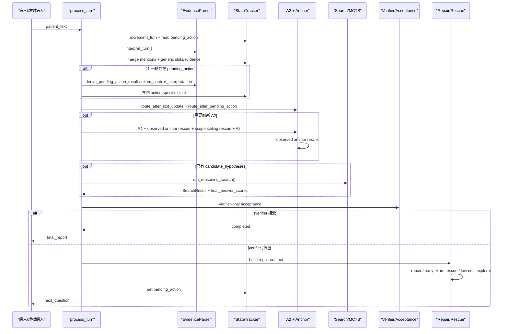

# brain 运行链路详解

本文说明的是 2026-05-06 当前版本里，[`brain/service.py`](../brain/service.py) 的真实单轮运行链路。

它主要回答下面这些问题：

- 病人说一句话之后，系统先做什么、后做什么
- `A1 / A2 / A3` 现在分别还承担什么职责
- `pending action`、`anchor`、`verifier`、`repair`、`MCTS` 之间到底怎么衔接
- 为什么当前版本已经不能再按“`A1 / A2 / A3 / A4 + stop rule`”的旧口径理解
- 当系统决定“继续问”或“输出最终报告”时，中间到底经历了哪些判断

这份文档基于当前已经落地的实现，不基于早期设计草图，也不按历史命名习惯倒推。

## 0. 先给当前版本一个准确结论

当前系统的主链已经不是旧版的：

- `A1 -> A2 -> A3 -> A4 -> stop rule`

而是：

- `turn_interpreter`
- `generic state merge`
- `pending action interpretation`
- `route merge`
- `A1 / A2 / A3`
- `trajectory aggregation`
- `verifier-only acceptance`
- `repair / exam rescue / low-cost explorer`
- `next question or final report`

更明确地说，当前实现有下面几件必须记住的事：

1. `A4` 已经不是当前对外主阶段名
2. 结构化 `stop rule` 已经移出主链路
3. `completed` 现在只由 verifier 或 observed final evaluator 的接受信号触发
4. `StopDecision` 这个数据结构还在，但它现在只是“接受结果 / 阶段性停止结果”的载体，不再代表旧版 stop-rule 引擎
5. `MCTS` 仍然负责搜索，但搜索前后的状态构建、候选重排、最终接受与 repair 都比早期版本更复杂

## 1. 当前应该怎样理解几个核心术语

### 1.1 `A1 / A2 / A3`

- `A1`：从本轮统一解释结果中提取首轮检索线索，也就是 `key_features`
- `A2`：基于 `R1` 候选、observed anchor rescue 和 scope sibling rescue 形成当前候选疾病排序
- `A3`：围绕当前候选疾病做 `R2 -> 动作构造 -> MCTS / rollout -> 选下一问`

### 1.2 `pending action interpretation`

它不是独立阶段，而是每轮正式进入 `A1 / A2 / A3` 之前的一层统一“上一轮回答消化器”。

它负责回答：

- 这句患者输入是不是在回答上一轮系统发出的具体问题
- 如果是，它对应的 `polarity / resolution / exam_context / evidence_state` 是什么
- 它应该把本轮路由推回 `A1 / A2 / A3 / FALLBACK` 的哪一边

### 1.3 `anchor`

`anchor` 也不是单独阶段，而是横切层：

- 会参与 `A2` 候选重排
- 会参与 `TrajectoryEvaluator` 的答案评分
- 会参与 verifier 拒停后的 repair 决策

当前 observed anchor 只认真实会话状态里的：

- `slots`
- `evidence_states`

它不会把 rollout / simulation 里的模拟阳性当作真实锚点。

### 1.4 `verifier-only acceptance`

当前是否 `completed`，不再由结构化 stop-rule 阈值控制，而是由：

- [`brain/acceptance_controller.py`](../brain/acceptance_controller.py)

里的 [`VerifierAcceptanceController`](../brain/acceptance_controller.py) 决定。

它只消费两类 verifier 信号：

- `llm_verifier`
- `observed_evidence_final_evaluator`

### 1.5 `repair`

`repair` 不是“把搜索推翻重来”，而是：

- 把 verifier 拒停原因显式结构化
- 把拒停原因写回 hypothesis 排名和 tree refresh 理由
- 专门选择一条最能补缺口的下一问

因此 repair 是当前系统里真正把“为什么还不能停”转成“下一步该问什么”的控制层。

## 2. 先认识几个关键运行时对象

如果不先理解这些对象，很容易看懂函数名却看不懂状态流。

### 2.1 `PatientContext`

它代表“当前用于推理的患者上下文视图”。

在不同位置它有两种常见形态：

1. 本轮原始上下文
   - 主要由本轮 `turn_interpreter` 结果派生
   - 供 `A1 / A2 / A3` 使用
2. verifier 累计上下文
   - 由 `_build_verifier_patient_context()` 构造
   - 会把累计 `slots / evidence_states / candidate_hypotheses / observed_anchor_index` 全部整理进去

所以 verifier 不只看“这一轮患者刚刚说了什么”，而是看“整场会话到现在已经确认了什么”。

### 2.2 `SessionState`

它代表整场问诊的真实全局状态。当前最重要的内容包括：

- `turn_index`
- `slots`
- `evidence_states`
- `mention_context`
- `exam_context`
- `candidate_hypotheses`
- `asked_node_ids`
- `metadata`

你可以把它理解成“当前真实问诊现场的唯一真相来源”。

### 2.3 `SlotUpdate / EvidenceState`

当前系统并不是只有一个“病人说了什么”的文本流，而是会把文本不断写回结构化状态。

其中：

- `SlotUpdate`：偏通用、偏槽位层的写回
- `EvidenceState`：偏目标证据节点、偏 pending-action 回答消化层的写回

当前 observed anchor 主要就是从这些真实状态里抽取的，不看模拟路径里的假想阳性。

### 2.4 `PendingActionResult / PendingActionDecision`

这两个对象是“上一轮问题被本轮回答后”的结构化结果。

可以把它们理解为：

- `PendingActionResult`
  - 这句回答本身怎么解释
- `PendingActionDecision`
  - 这个解释结果接下来应该把流程往哪里推

### 2.5 `MctsAction`

它表示系统准备继续问出去的一条动作。常见动作类型包括：

- `verify_evidence`
- `collect_exam_context`
- `collect_general_exam_context`
- `collect_chief_complaint`
- `probe_feature`

若本轮最终需要继续追问，系统会把选中的 `MctsAction` 写回成下一轮的 `pending_action`。

### 2.6 `SearchResult`

它是一轮 `A3` 搜索的主要输出。当前至少会包含：

- `selected_action`
- `root_best_action`
- `repair_selected_action`
- `trajectories`
- `final_answer_scores`
- `best_answer_id`
- `best_answer_name`
- `metadata`

也就是说，`SearchResult` 同时承载了：

- 搜索认为当前最可能的最终答案是谁
- 搜索认为下一问默认应该问什么
- repair 是否把这个默认动作改写掉了

### 2.7 `FinalAnswerScore`

它不是 A2 原始候选疾病，而是“trajectory 聚合之后的最终答案候选评分对象”。

其中最重要的字段包括：

- `consistency`
- `diversity`
- `agent_evaluation`
- `final_score`
- `metadata`

当前 verifier 的大量信号也是挂在 `metadata` 里的，例如：

- `verifier_mode`
- `verifier_should_accept`
- `verifier_reject_reason`
- `verifier_accept_reason`
- `verifier_recommended_next_evidence`
- `verifier_alternative_candidates`
- `observed_evidence_guard_applied`
- `scope_acceptance_guard_applied`

### 2.8 `StopDecision`

它现在只是一个统一的“停 / 不停”结构，不再等同于旧 stop-rule 引擎。

当前最常见的三类用途是：

1. verifier 最终接受
2. verifier 明确拒停
3. 少数阶段性停止
   - 例如反复主诉澄清后仍没有信号
   - 或没有更多低成本问题可以问

## 3. 一张总图：当前 `process_turn()` 的单轮主链

如果只想记一句话，那么就是：

- 当前系统是“先把本轮回答写成真实状态，再在 `A1 / A2 / A3` 间切换，最后由 verifier + repair 决定停还是继续问”

## 4. 当前版本相对旧版最重要的算法变化

### 4.1 当前主入口不是 `MedExtractor`，而是 `turn_interpreter`

虽然默认依赖里仍会构造 `MedExtractor`，但 `process_turn()` 主链真正先调用的是：

- `EvidenceParser.interpret_turn(patient_text, pending_action=...)`

这意味着当前单轮主链已经从：

- 多套解释器各自重复解析同一句患者话

变成了：

- 先统一抽 `mentions`
- 再由同一份 `mentions` 派生：
  - `PatientContext`
  - `A1ExtractionResult`
  - `PendingActionResult`
  - `mention_context`

### 4.2 `A2` 已不是“R1 top-k 直接排序”

当前 `A2` 至少包含四层：

1. `R1` 原始候选
2. `observed anchor rescue`
3. `scope sibling rescue`
4. `observed anchor rerank`

所以它已经不是“检索一遍然后简单取 top1”的结构。

### 4.3 `A3` 后面不是旧 `A4`，而是“轨迹聚合 + verifier + repair”

当前 `run_reasoning_search()` 结束后，不会进入旧阶段名 `A4`，而是进入：

- `TrajectoryEvaluator.score_groups(...)`
- `select_best_answer(...)`
- `VerifierAcceptanceController.should_accept_final_answer(...)`
- `_build_verifier_repair_context(...)`
- `_choose_repair_action(...)`

### 4.4 结构化 `stop rule` 已移除

当前主链路已经不再使用：

- `BRAIN_ACCEPTANCE_PROFILE`
- `anchor_controlled`
- `no_stop_gate`

现在的最终完成只看 verifier 是否明确接受。

### 4.5 rollout 仍是启发式搜索，不是真实患者对话模拟

当前 [`brain/simulation_engine.py`](../brain/simulation_engine.py) 明确写着：

- simulation 不真的调用 LLM 或患者代理

它是用：

- 动作 `prior`
- 关系类型 bonus
- 当前 hypothesis score
- 正 / 负 / 模糊三类分支概率与 reward

来估计局部期望收益。

所以 `MCTS` 现在是搜索器，不是最终裁判。

## 5. `process_turn()` 逐步拆解

下面按 [`brain/service.py`](../brain/service.py) 当前真实顺序来讲。

### 5.1 先推进轮次并读取上一轮 `pending_action`

开头先做：

- `StateTracker.increment_turn()`
- `StateTracker.get_pending_action()`

这一步的含义是：

- 本轮输入到底是新的自由描述
- 还是在回答上一轮系统问出去的那个问题

这也是为什么当前系统不是机械的单向流水线，而更像“单轮编排器”。

### 5.2 统一调用一次 `turn_interpreter`

主链入口先调用：

- `EvidenceParser.interpret_turn(patient_text, pending_action=...)`

这里有两个要点。

第一个要点是：同一句患者话只解释一次。

后面的：

- `patient_context`
- `a1_result`
- `generic_updates`
- `pending_action_result`

都尽量复用这同一份统一解释结果。

第二个要点是：对稀疏 opening 有容错。

如果抽取器因为输入过短而返回空提及，代码会进入：

- `empty_extraction_fallback`

也就是说，系统不会因为“来问问、最近不舒服”这种开场过短，就直接把会话判死。

### 5.3 在 generic merge 前先做一次“无结果不是阴性”的归一化

当前系统会对一类高风险输入先做保护性处理：

- 高成本检查
- 病原学证据
- 数值型 detail

如果患者说的是：

- “没做过”
- “没听说”
- “不记得”

它不会直接被当成结果阴性，而是会在写状态前先归回 `unclear`。

这样做的目的很明确：

- 避免把“没有检查结果”误记成“检查结果明确阴性”
- 避免后续 anchor / verifier / repair 把这种回答当作 hard negative

### 5.4 先做 generic state merge

统一提及项随后会先写回：

- `mention_context`
- `slots`
- `generic evidence_states`

当前要特别记住一点：

- 系统不是“先判断阶段，再写状态”
- 而是“先把本轮患者话写成真实全局状态，再依据更新后的状态判断阶段”

这和早期直觉式理解很不一样。

### 5.5 generic merge 还会触发后续刷新标记

如果本轮写入里包含强更新，系统会进一步标记：

- `force_a2_refresh`
- `force_a2_refresh_reason`
- `force_tree_refresh`

它们的意义分别是：

- `A2` 下轮或本轮需要重算
- 搜索树不能再盲目沿用旧分支
- 后续 search 可能需要 reroot 或重建

### 5.6 再消化上一轮 `pending_action`

如果上一轮已经问出去一个动作，这里会调用：

- `update_from_pending_action(...)`

它是当前链路里最容易和旧 `A4` 混淆的部分，但本质上已经不是旧 `A4` 了。

#### 5.6.1 没有 `pending_action`

说明这轮患者输入是新的自由叙述，不是上一轮问题的回答。

这时函数直接返回：

- `None, None, None, []`

后续继续走正常的 `A1 / A2 / A3`。

#### 5.6.2 `collect_chief_complaint`

如果上一轮动作只是主诉 intake，那么这轮的逻辑很简单：

- 记录 `last_answered_action`
- 清掉 `pending_action`
- 路由重新拉回 `A1`

也就是说：

- 患者现在终于开始正式补充主诉
- 系统要重新从 A1 提主线索

#### 5.6.3 `collect_exam_context / collect_general_exam_context`

这类动作不是普通证据验证，而是检查上下文消化。

它会做的事情包括：

- 解释患者有没有做过检查
- 提取说到的检查名
- 提取说到的检查结果
- 判断是否还需要 follow-up
- 先把 exam context 写回 session
- 如果结果已经足够具体，再映射成具体 `slot / evidence_state / hypothesis feedback`

这里当前的真实语义不是“演绎判断证据真假”，而是：

- 先把“这类检查做没做、做了哪些、结果说清没”补完整

如果患者只说“做过检查”，但没有给结果，系统还会挂一个：

- `exam_context_followup_action`

下一轮优先追问具体检查结果。

#### 5.6.4 普通 `verify_evidence / probe_feature`

这类是当前最常见的 pending-action 分支。

它会做的事情是：

1. 从统一 `mentions` 里解释出目标节点回答
2. 构造或富化目标 `EvidenceState`
3. 写回 `evidence_states`
4. 记录 `pending_action_audit`
5. 把这次回答立即反馈到 hypothesis 排名
6. 必要时标记 `force_a2_refresh`
7. 记录 action reward 与负反馈冷却
8. 再根据更新后的状态做下一阶段路由

换句话说，当前系统不是“先等整轮结束再总结这次回答”，而是：

- 回答一旦被目标化解释，就立即影响候选诊断竞争态

### 5.7 `pending_action` 里的局部 `STOP` 也不会直接停

这是当前版本非常关键的一条规则。

当前代码会调用：

- `_gate_pending_action_route()`

把来自 pending-action 的 `STOP` 先降级成：

- `A3`

原因非常明确：

- 上一轮回答看起来“像是够停了”
- 也必须先经过 search + verifier 的全局二次确认

所以当前系统不允许“某一条局部回答自己决定整场会话结束”。

### 5.8 根据最新状态重新决定 `effective_stage`

generic merge 和 pending-action merge 完成后，系统会重新读一次最新 `SessionState`，再组合两类路由：

- `route_after_pending_action`
- `route_after_slot_update`

得到本轮真正的 `effective_stage`。

当前优先级可以概括为：

- 如果 pending-action 没给出更强约束，就沿用状态路由
- 如果 pending-action 明确要求转去 `A2 / A3 / FALLBACK`，优先听从它
- 只有 pending-action 为空或只要求回 `A1` 时，才让状态路由接管

### 5.9 先处理几类不必进入正式 search 的快捷分支

在正式进入 `A2 / A3` 之前，当前实现还会优先检查几类“前置特殊分支”。

#### 5.9.1 `exam_followup_action`

如果上一轮已经确认：

- 患者做过检查
- 但结果还没说清

那么这一轮优先继续追问结果本身，不让 search 立刻跳去问别的证据。

#### 5.9.2 `repeated_chief_complaint_without_signal`

如果主诉澄清已经连续进行，但仍然没有任何可推理的有效临床信号，那么当前系统会直接阶段性停止，而不是机械地继续 intake。

#### 5.9.3 `collect_chief_complaint`

如果当前输入几乎没有可推理的症状、病史或检查信息，那么系统会回到主诉 intake 动作。

#### 5.9.4 `FALLBACK`

如果当前状态本身就不适合进入正式检索搜索，会走冷启动探针动作。

### 5.10 A1 现在只是“首轮检索视图”，不是第二套状态机

当前 `A1` 的角色已经被收口得比较明确：

- 它只负责从统一解释结果里生成 `key_features`
- 它本身不再维护第二套独立解释逻辑

所以现在更准确的说法是：

- `A1` 是统一提及项之上的一个轻量首轮检索视图

## 6. `A2` 现在到底怎么跑

### 6.1 什么时候会真的重跑 `A2`

当前 `_should_refresh_a2()` 主要看四件事：

1. 当前还没有 `candidate_hypotheses`
2. `effective_stage == "A2"`
3. `state.metadata["force_a2_refresh"] == True`
4. 本轮 `A1` 确实抽到了新的 `key_features`

只要满足其中一种，当前轮就会重跑 `A2`。

### 6.2 什么时候会复用 cached A2

如果当前是标准 `A3` 追问轮次，且候选假设没有必要重建，那么系统会调用：

- `_build_cached_a2_result(...)`

这意味着：

- 很多 A3 追问轮并不会每轮都重算一遍 `A2`
- 系统会复用上一轮的候选排序，避免每轮重复做相同工作

### 6.3 `_run_a2()` 的真实步骤

当前 `_run_a2()` 至少会做下面几步：

1. 读取并清理本轮 `force_a2_refresh_*` 标记
2. 调用 `retrieve_r1_candidates(...)`
3. 调用 `retrieve_observed_anchor_candidates(...)`
4. 调用 `retrieve_scope_sibling_candidates(...)`
5. 用 `_merge_hypothesis_candidate_pools(...)` 合并原始候选和 rescue 候选
6. 调用 `HypothesisManager.run_a2_hypothesis_generation(...)`
7. 把主候选和备选扩成统一 `HypothesisScore`
8. 再做一次 observed anchor rerank
9. 最终写回 `state.candidate_hypotheses`

### 6.4 为什么还要做 observed anchor rescue

它的核心作用是：

- 避免真实疾病因为 R1 top-k 太窄而被漏掉
- 让真实会话里已经出现强 anchor 的候选不要在候选池外“永远没有翻身机会”

所以它不是锦上添花，而是当前 `A2` 能否稳住真值疾病的重要纠偏层。

### 6.5 为什么还要做 scope sibling rescue

scope sibling rescue 主要解决的是：

- 同病原、同大类疾病下粒度相近的兄弟候选
- 仅靠粗检索分不干净的作用域竞争问题

这也是为什么当前系统后面还要有：

- `scope_acceptance_guard`

因为粒度接近的候选，本来就是当前问诊场景下最容易误停的地方。

### 6.6 A2 最后为什么还要再 rerank 一次

这是因为：

- `run_a2_hypothesis_generation()` 产出的排序还主要受检索与生成逻辑影响
- 真实 observed anchor 的强弱，需要在最终候选排序里再显式前移一次

所以当前 `A2` 的最终输出不是“R1 排名”，而是“R1 + rescue + hypothesis generation + observed anchor rerank”的组合结果。

## 7. `run_reasoning_search()` 里现在到底做了什么

### 7.1 先绑定或重建显式搜索树

当前会通过：

- `_ensure_search_tree(...)`

决定：

- 沿用旧树
- reroot
- 重建 root

这里的设计目的很明确：

- 如果状态签名和 top hypothesis 没变，就尽量复用已有搜索树
- 如果 verifier repair 或 hypothesis 排名变化很大，就让树换根或重建

### 7.2 root / leaf 里保存的不是“真实会话状态”，而是 rollout 快照

当前树节点里会保存一份轻量：

- `rollout_state`

后续每次从叶子展开时，会通过：

- `_build_rollout_context_from_leaf(...)`

恢复出一份临时分支上下文。

这样做的好处是：

- rollout 可以自由前瞻和分叉
- 不会直接污染真实 `SessionState`

### 7.3 外层 rollout 循环是标准的 `select -> expand -> simulate -> backpropagate`

当前外层搜索循环会按 `num_rollouts` 执行。

每一轮大致做：

1. `select_leaf()`
2. `_build_rollout_context_from_leaf()`
3. `_expand_actions_for_leaf()`
4. `expand_node()`
5. 对每个 child 调用 `rollout_trajectories_from_tree_node()`
6. `backpropagate()`

这里有两个当前实现层面的关键点：

- `select_leaf()` 不是摊平叶子排序，而是真正按 tree policy 下探
- 一个 leaf 扩出多个 child 后，不是只选一个继续推演，而是会对多个 child 都做独立 rollout

### 7.4 A3 动作扩展来自 `R2`

当前动作扩展入口是：

- `_expand_actions_for_leaf(...)`

它会对当前分支的主假设调用：

- `retrieve_r2_expected_evidence(...)`

再由：

- `ActionBuilder.build_verification_actions(...)`

把候选证据转成真正可执行的问题动作。

所以当前 `A3` 的实质是：

- 围绕当前候选疾病，找最值得继续验证的证据节点，并把它们转成可问问题

### 7.5 当前 rollout 仍然是启发式 rollout，不是真的再调一个“患者 LLM”

这点必须强调。

[`brain/simulation_engine.py`](../brain/simulation_engine.py) 当前明写：

- simulation 不真的调用 LLM 或患者代理

它是根据：

- 动作 `prior`
- `relation_type bonus`
- 当前 hypothesis score
- `positive / negative / doubtful` 三分支概率与 reward

来估计局部期望收益。

因此当前 `rollout` 的本质是：

- 启发式局部前瞻

而不是：

- 真正把问题问给一个模拟患者再拿回答回来继续推理

### 7.6 rollout 完成后，不是直接拿单条 top1 轨迹，而是先按最终答案分组

所有 rollout 轨迹会先进入：

- `TrajectoryEvaluator.group_by_answer(...)`

也就是说，系统不直接问：

- “哪条路径分数最高？”

而是先问：

- “这些路径最后都支持哪些最终答案？”

这一步之后才会进入：

- `TrajectoryEvaluator.score_groups(...)`

### 7.7 verifier 看的不是本轮患者短句，而是累计会话上下文

在进入 `score_groups(...)` 前，系统会构造：

- `verifier_patient_context = _build_verifier_patient_context(...)`

这一步会把下面这些内容整理进 verifier 视图：

- 最新患者回答
- 累计 `slots`
- 累计 `mention_context`
- 累计 `evidence_states`
- 当前 `candidate_hypotheses`
- `observed_anchor_index`

这意味着 verifier 的视角是：

- “整场会话到现在，真实确认了哪些支持、反证、未决证据”

而不是：

- “仅凭这轮患者刚说的这一句判断要不要停”

### 7.8 如果 rollout 没形成有效答案组，还有 candidate-state fallback

如果当前 `final_scores` 为空，或只得到 `UNKNOWN` 类答案组，系统会调用：

- `score_candidate_hypotheses_without_trajectories(...)`

用当前候选态做一组保守的最终答案评分。

这一步很重要，因为它避免：

- search 路径断层时，`best_answer` 直接空掉

当前这个 fallback 对外表现为：

- `verifier_mode = observed_evidence_final_evaluator`

## 8. verifier 现在是怎么工作的

这一节单独拆，因为它是当前系统里最容易被误解的部分。

### 8.1 先分清两层：谁产生 verifier 信号，谁消费 verifier 信号

当前 verifier 相关逻辑分成两层：

1. `TrajectoryEvaluator`
   - 负责为答案组产出 verifier 信号
2. `VerifierAcceptanceController`
   - 负责消费 verifier 信号，真正决定能不能停

因此：

- 真正“调用大模型做裁判”的地方在 `TrajectoryEvaluator`
- `AcceptanceController` 更像最后的统一接受闸门

### 8.2 `score_groups()` 给每个答案组打什么分

当前每个答案组至少会有三类分量：

- `consistency`
- `diversity`
- `agent_evaluation`

其中：

- `consistency`
  - 这个答案占了多少 rollout
- `diversity`
  - 同一答案内部路径是否过于单一
- `agent_evaluation`
  - 当前“裁判层”对这个答案临床可信度的代理评分

而真正的 `final_score` 还会进一步融合：

- observed anchor bonus
- simulated key evidence penalty
- candidate rank prior
- scope penalty

所以当前最终答案评分已经不是单一 rollout 均分。

### 8.3 `agent_evaluation` 有哪几种模式

当前最重要的几种 `verifier_mode` 是：

- `llm_verifier`
- `llm_verifier_deferred`
- `fallback`
- `observed_evidence_final_evaluator`
- `empty`

其中只有下面两种可以直接参与最终接受：

- `llm_verifier`
- `observed_evidence_final_evaluator`

这也是为什么 `AcceptanceController` 里只认这两种 mode。

### 8.4 `llm_verifier` 默认不会每轮都调用

截至 2026-05-06，当前默认配置是：

- `agent_eval_mode: llm_verifier`
- `llm_verifier_min_turn_index: 2`
- `llm_verifier_min_trajectory_count: 2`

也就是说：

- 第 1 轮通常不会直接调用 LLM verifier
- 轨迹数量太少时，也不会直接调用

如果不满足条件，当前轮会先退回：

- `llm_verifier_deferred`
- 或普通 `fallback`

这背后的意图是：

- 避免每一轮都支付高成本 verifier 调用
- 先让系统收集到基本足够的搜索信号

### 8.5 LLM verifier 的输入到底是什么

当前 `_compute_llm_agent_evaluation()` 会把下面这些东西送给 LLM：

- `patient_context`
- `answer_id`
- `answer_name`
- `best_trajectory`
- `observed_session_evidence`
- `observed_answer_specific_support`
- `simulated_trajectory_evidence`
- `trajectory_count`
- `answer_candidates`

这里尤其要注意两类证据：

1. `observed_session_evidence`
   - 真实会话中已经确认或否认的证据
2. `simulated_trajectory_evidence`
   - rollout 模拟路径里假想出来的证据

当前 prompt 明确要求 LLM 必须区分这两者，不能把模拟阳性当成真实已确认事实。

### 8.6 LLM verifier 的输出 schema 长什么样

当前 prompt 要求至少输出这些字段：

- `score`
- `should_accept_stop`
- `reject_reason`
- `reasoning`
- `missing_evidence`
- `risk_flags`
- `recommended_next_evidence`
- `alternative_candidates`
- `accept_reason`

其中：

- `reject_reason` 只允许三类
  - `missing_key_support`
  - `strong_alternative_not_ruled_out`
  - `trajectory_insufficient`
- `accept_reason` 只允许三类
  - `key_support_sufficient`
  - `alternatives_reasonably_ruled_out`
  - `trajectory_stable`

这点非常重要，因为后面的 repair 分流就是靠这些固定枚举驱动的。

### 8.7 verifier 输出不会被原样盲信，而是还要做标准化

当前 LLM verifier 的输出后面还会经过两层标准化：

1. `_normalize_reject_reason(...)`
2. `_normalize_accept_reason(...)`

它们的作用是：

- 如果 LLM 漏填字段
- 或者字段格式不规范
- 或者给了不在允许枚举内的值

系统会保守地回退到固定枚举，而不会让自由文本直接驱动 repair。

### 8.8 第一层护栏：`observed_evidence_acceptance_guard`

即便 LLM 想接受，系统也不会立刻信。

当前会再过一道：

- `_apply_observed_evidence_acceptance_guard(...)`

它主要防的是这种情况：

- 当前答案的关键支持只出现在 rollout 模拟阳性里
- 真实会话里一个对应的特异支持都还没有

这时系统会强制把接受改写成拒停，并把拒停原因收敛为：

- `missing_key_support`

这道护栏的本质是：

- 搜索器可以假想“这条检查如果阳性会很有价值”
- 但不能因为“假想阳性很漂亮”就直接停诊

### 8.9 第二层护栏：`scope_acceptance_guard`

即便真实会话里有支持，系统还会再检查一次粒度 / 作用域是否对齐。

当前会调用：

- `_apply_scope_acceptance_guard(...)`

它主要防的是：

- 同病原但粒度不对
- 同类疾病但真实证据更支持另一个更具体候选
- 当前答案存在明显作用域缺口

如果 `scope_block_score` 太高，系统会强制拒停，并把拒停理由转成：

- `strong_alternative_not_ruled_out`

### 8.10 如果没有有效 rollout，还会走 observed final evaluator

当 rollout 没形成可用答案组时，系统会调用：

- `_evaluate_observed_final_candidate(...)`

它本质上是一个 deterministic verifier，只消费真实会话证据，不读取模拟阳性。

它主要看：

- `exact_scope_anchor_score`
- `family_scope_anchor_score`
- `definition_anchor_score`
- `phenotype_support_score`
- `background_support_score`
- `anchor_negative_score`
- `scope_mismatch_score`
- `low_cost_profile`

如果条件足够好，它会直接给出：

- `verifier_mode = observed_evidence_final_evaluator`
- `verifier_should_accept = true`

### 8.11 `AcceptanceController` 最终是怎么判的

当前 [`VerifierAcceptanceController.should_accept_final_answer()`](../brain/acceptance_controller.py) 的规则很简单：

1. `answer_score is None`
   - 拒绝，原因 `no_answer_score`
2. `verifier_mode` 不在允许集合里
   - 拒绝，原因 `verifier_not_ready`
3. `verifier_should_accept = true`
   - 接受，原因 `final_answer_accepted`
4. 否则
   - 拒绝，原因 `verifier_rejected_stop`
   - 同时把 `repair_reject_reason` 写进返回 metadata

这正是“verifier-only acceptance”的真实含义：

- 最终 completed 不再由额外 stop-rule 阈值决定
- 只看 verifier 是否明确接受

## 9. verifier 拒停后，repair 现在怎么运作

### 9.1 `_build_verifier_repair_context()` 会整理什么

如果 verifier 没有接受，系统会构造：

- `_build_verifier_repair_context(...)`

当前 repair context 里通常至少会整理出：

- `reject_reason`
- `path_control_reason`
- `recommended_next_evidence`
- `alternative_candidates`
- `verifier_reasoning`
- `verifier_reject_reason_source`
- `verifier_schema_valid`
- `anchor_answer_features`
- `anchor_stronger_alternative_candidates`
- `missing_evidence_roles`
- `observed_anchor_index`
- `repair_stage`
- `current_answer_id`
- `current_answer_name`

也就是说，repair 并不是只拿一个简单字符串，而是拿一整包“为什么不能停、缺什么、该转向谁”的结构化上下文。

### 9.2 当前答案已有的推荐证据，不会在 repair 里丢失

`repair_context` 构造时，会把：

- verifier 推荐的 `recommended_next_evidence`
- 当前 hypothesis 自己已有的 `recommended_next_evidence`

做一次合并。

这样可以避免出现：

- verifier 想补一类证据
- hypothesis 自己也有一组待补证据
- 结果 repair 只保留了一边

### 9.3 某些拒停理由会自动补齐 alternative candidates

如果 reject reason 明显是竞争性拒停，但 verifier 没明确列出 alternatives，系统会从当前 hypothesis 排名里兜底构造几个强备选。

这样做的目的很实际：

- 不能因为 verifier 漏列备选，就让 repair 完全失去竞争诊断方向

### 9.4 `missing_key_support` 会在某些条件下升级成 competition repair

当前 `_maybe_escalate_missing_key_support_to_competition()` 会检查几种情况：

- 当前答案几乎没有真实 observed anchor
- 备选答案存在更强 anchor
- 同一答案已经连续多轮 `missing_key_support`
- verifier 推荐缺口明显偏高成本检查，而强备选已经有更好真实 anchor

一旦满足，repair 会从：

- “继续给当前答案补证据”

升级成：

- “直接围绕更强竞争诊断 repair”

这一步很重要，因为它避免系统一直围着一个弱 top1 自我补证，问很多高成本问题却仍不转向。

### 9.5 `_apply_verifier_repair_strategy()` 会真的回写 hypothesis 排名

当前 repair 不是只给前端一个解释，它还会真的改写内部候选排序。

主要入口是：

- `_apply_verifier_repair_strategy(...)`
- `HypothesisManager.apply_verifier_repair(...)`

它会做几件事：

1. 给当前被拒停答案按 reject reason 降权
2. 给 verifier 点名的备选诊断加权
3. 把 verifier 推荐证据合并写进 hypothesis metadata
4. 记录 `repair_feedback_count`
5. 设置 `force_tree_refresh` 和 `tree_refresh_reason`

这意味着：

- repair 之后，下一轮 search 的起点已经和 repair 前不一样了

### 9.6 不同 reject reason 会驱动不同 repair 方向

当前可以粗略分成四类。

#### 9.6.1 `missing_key_support`

含义是：

- 当前 top1 还缺关键支持证据

repair 倾向会变成：

- 优先补 verifier 推荐的关键证据
- 若这些证据偏高成本且强备选已有更强 anchor，则可能升级成 competition repair

#### 9.6.2 `strong_alternative_not_ruled_out` / `anchored_alternative_exists`

含义是：

- 当前 top1 还没有真正压过某个强竞争诊断

repair 倾向会变成：

- 更敢于围绕备选诊断拿动作
- 更敢于切去问对竞争诊断更关键、更具区分度的证据

#### 9.6.3 `hard_negative_key_evidence`

含义是：

- 当前答案已经出现关键反证，或者关键支持被明确否定

repair 倾向会变成：

- 先围绕反证相关检查或高价值证据做确认
- 或推动当前答案显著降权

#### 9.6.4 `trajectory_insufficient`

含义是：

- 当前不是证据本身一定错，而是搜索路径还不够稳定

repair 倾向会变成：

- 继续补有区分度的问题
- 或推动更多路径分化，而不是过早停机

### 9.7 `_choose_repair_action()` 选出来的动作不一定还是当前 top1 的动作

当前 repair 选动作时，不会机械坚持“继续问当前 top1”。

它可以：

- 继续围绕当前答案补关键支持
- 转去问高价值检查上下文
- 转去问备选诊断的鉴别证据

这也是为什么当前系统在 verifier 拒停之后，可能出现：

- `selected_action.hypothesis_id` 已经不是原本 top1

### 9.8 repair 后还有两层动作覆盖

即便 repair 选出动作，后面还可能再被两层逻辑改写：

1. `early_exam_context_rescue`
2. `low_cost_explorer`

#### `early_exam_context_rescue`

当当前 top hypothesis 明显更依赖检查结果，而常规 repair / search 动作不够具体时，系统会优先问检查上下文。

#### `low_cost_explorer`

当当前证据揭示不足时，系统会主动在 top3 候选里找低成本且有区分度的问题。

当前还有一个保护规则：

- 如果 repair 动作仍然可问，不让 low-cost explorer 轻易把它抢走

也就是说，repair 在动作优先级上不是绝对的，但会被保护。

## 10. `stop rule` 删除后，还剩下哪些“停止”来源

为了避免后续复盘继续混淆，这里单列说明。

### 10.1 已删除的东西

当前主链已经删除的是：

- 旧版结构化 `stop rule` 判停器
- 基于 `BRAIN_ACCEPTANCE_PROFILE / anchor_controlled / no_stop_gate` 的最终 completed 决策

### 10.2 仍然保留的东西

当前仍然保留的是：

1. `StopDecision` 数据结构
2. verifier-only acceptance
3. 少量阶段性 stop helper

例如：

- `repeated_chief_complaint_without_signal`
- `no_exam_and_no_low_cost_questions`
- `exam_not_done_and_no_low_cost_questions`
- `insufficient_observable_evidence`

所以准确说法应该是：

- 旧 `stop rule` 引擎没了
- 但系统仍然保留“在某些条件下结束本轮或结束会话”的能力

## 11. 当前版本何时返回 `final_report`，何时返回 `next_question`

### 11.1 正常完成

如果：

- `accept_decision.should_stop == True`

那么系统直接结束问诊。

若本轮存在有效 search 信号，优先输出：

- `build_final_reasoning_report(...)`

否则退回普通：

- `build_final_report(...)`

### 11.2 阶段性停止

如果：

- 当前答案也还不能接受
- 但系统已经没有可继续动作
- 并且触发了 exam-limited 类 stop

那么也会输出阶段性 `final_report`。

### 11.3 继续追问

如果当前既不能接受，也没有触发阶段性 stop，那么系统会：

1. 把 `selected_action` 渲染成自然语言问题
2. `mark_question_asked(...)`
3. `set_pending_action(selected_action)`
4. 返回：
   - `next_question`
   - `pending_action`
   - `search_report`

## 12. 当前单轮返回结构里最值得看的字段

无论本轮最后是结束还是继续问，当前返回结构都会尽量统一包含：

- `patient_context`
- `linked_entities`
- `a1`
- `a2`
- `a2_evidence_profiles`
- `a3`
- `pending_action_result`
- `pending_action_decision`
- `route_after_pending_action`
- `route_after_slot_update`
- `updates`
- `pending_action_audit`
- `search_report`

如果本轮结束，还会额外有：

- `final_report`

如果本轮继续追问，还会额外有：

- `next_question`
- `pending_action`

### 12.1 最值得在前端或 replay 里重点观察的几个字段

如果是为了复盘问题，建议优先看：

- `pending_action_result`
  - 上一轮回答到底被解释成了什么
- `route_after_pending_action`
  - 上一轮回答解释后，系统本来想往哪个阶段走
- `a2_evidence_profiles`
  - 当前候选诊断排序背后有哪些支持、反证和待验证证据
- `search_report.final_answer_scores`
  - 当前答案组为什么这样排序
- `search_report.verifier_repair_context`
  - verifier 为什么拒停，repair 想补什么
- `search_report.observable_repair_context`
  - 最终动作是怎么从 root action 被改写成 repair / rescue / explorer 动作的

## 13. 推荐按什么顺序读源码

如果要把源码和当前文档一一对上，推荐按下面这个顺序看。

1. [`brain/service.py`](../brain/service.py)
   - 先看 `process_turn()`
2. [`brain/service.py`](../brain/service.py)
   - 再看 `update_from_pending_action()`、`_run_a2()`、`run_reasoning_search()`
3. [`brain/evidence_parser.py`](../brain/evidence_parser.py)
   - 看 `interpret_turn()`、`derive_pending_action_result()`、`interpret_exam_context_answer()`
4. [`brain/hypothesis_manager.py`](../brain/hypothesis_manager.py)
   - 看 A2 组织与 `apply_verifier_repair()`
5. [`brain/evidence_anchor.py`](../brain/evidence_anchor.py)
   - 看 observed anchor 分类与 rerank
6. [`brain/simulation_engine.py`](../brain/simulation_engine.py)
   - 看 heuristic rollout 是怎么估收益的
7. [`brain/trajectory_evaluator.py`](../brain/trajectory_evaluator.py)
   - 看答案聚合、LLM verifier、observed final evaluator、guard
8. [`brain/acceptance_controller.py`](../brain/acceptance_controller.py)
   - 看最终 verifier-only acceptance
9. [`brain/action_builder.py`](../brain/action_builder.py)
   - 看 repair 推荐证据怎么影响动作排序和问句生成

## 14. 当前版本和旧版口径的最短对照

如果你还在用旧脑图理解当前系统，可以直接替换成下面这张对照表。

| 旧理解 | 当前理解 |
| --- | --- |
| `A1 -> A2 -> A3 -> A4 -> stop rule` | `turn_interpreter -> state merge -> pending action -> A1/A2/A3 -> verifier acceptance -> repair/rescue/explorer` |
| `A4` 是正式对外阶段 | `A4` 只是历史命名残留，不再是主阶段 |
| `stop rule` 决定 completed | verifier / observed final evaluator 决定 completed |
| rollout 之后就接最终判停 | rollout 之后还要做 trajectory aggregation、verifier、repair |
| `A2` 只看 R1 候选 | `A2 = R1 + rescue pools + hypothesis generation + observed anchor rerank` |
| 搜索动作一旦选出就直接发问 | 还可能被 repair、early exam rescue、low-cost explorer 覆盖 |
| 某条局部回答说“差不多够了”就能停 | 当前必须先经过 search + verifier 二次确认 |

## 15. 一句话总结当前实现

当前 `brain/` 已经演化成一个：

- 以 `turn_interpreter` 为统一单轮入口
- 以 `A1 / A2 / A3` 为主阶段
- 以显式 `MCTS + heuristic rollout` 为搜索内核
- 以 `observed anchor + llm_verifier + observed final evaluator + repair` 为后置安全与纠偏层
- 并且不再依赖旧结构化 `stop rule`

的交互式诊断系统。
