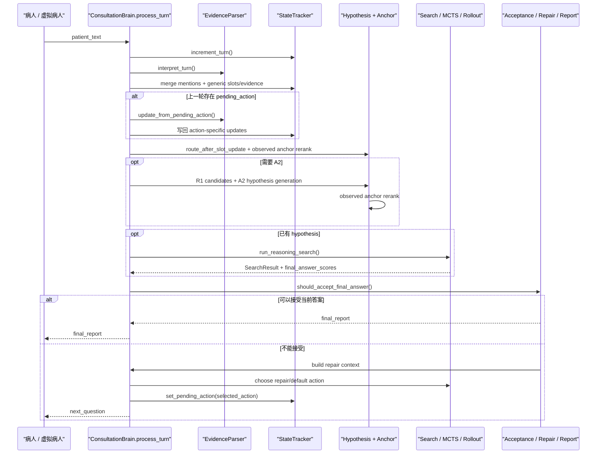

# brain 运行链路详解

这份文档回答的是当前版本里的这个问题：

从“病人说了一句话”开始，到系统决定“继续问什么”或“输出报告”为止，[`brain/service.py`](../brain/service.py) 现在到底按什么顺序运行。

本文基于当前已经落地的实现，而不是早期“四阶段 A1/A2/A3/A4 + stop rule 合同”的旧设计。

## 0. 先说清当前术语

当前 `brain/` 对外应该按下面这套术语理解：

- 主流程是 `A1 / A2 / A3` 三个阶段
- `pending action interpretation` 是每轮正式进入 A1/A2/A3 之前的统一回答消化层
- `anchor` 不是独立阶段，而是横切在 `A2` 重排、verifier 评估和 repair 三处的真实证据控制层
- [`brain/acceptance_controller.py`](../brain/acceptance_controller.py) 是当前最终接受入口，只消费 verifier / observed-evidence final evaluator 的接受或拒绝信号

如果你在源码或历史输出里看到 `A4`，通常指的是历史残留命名，例如部分 `source_stage` metadata；它已经不是当前对外描述系统运行链路时的主阶段名称。

## 1. 总入口

对外部调用者来说，核心接口仍然只有两个：

1. `brain.start_session(session_id)`
2. `brain.process_turn(session_id, patient_text)`

无论是实时前端、命令行 demo，还是离线 replay，真正的单轮处理都收敛到：

- [`ConsultationBrain.process_turn()`](../brain/service.py)

也就是说，当前系统的“单轮大脑”仍然是 `process_turn()`，只是它内部的编排已经从早期四阶段版本演化成了：

- 统一解释当前回答
- 消化上一轮 `pending_action`
- 在 `A1/A2/A3` 之间切换
- 用 `anchor` 控制候选重排、停机与 repair

## 2. 外层是谁在调用它

### 2.1 实时前端

- [`frontend/app.py`](../frontend/app.py) 中实时模式会构造 brain
- 每次用户输入后调用 `brain.process_turn(...)`

### 2.2 命令行 demo

- [`scripts/run_brain_demo.py`](../scripts/run_brain_demo.py)
- `main()` 中先 `start_session()`，然后循环 `process_turn()`

### 2.3 离线 replay / 虚拟病人自动对战

- [`scripts/run_batch_replay.py`](../scripts/run_batch_replay.py)
- [`simulator/replay_engine.py`](../simulator/replay_engine.py)

外层流程大致是：

1. 虚拟病人给出 opening
2. `brain.process_turn(session_id, opening_text)`
3. 系统返回 `next_question`
4. 虚拟病人回答该问题
5. 再次调用 `brain.process_turn(...)`

所以从 `brain/` 视角看，实时问诊和 replay 的根本差别只有一点：

- 谁来提供这一轮的 `patient_text`

## 3. 当前链路最重要的变化

理解当前版本时，先记住下面三点。

### 3.1 每轮只做一次统一解释

`process_turn()` 开头会先调用：

- `EvidenceParser.interpret_turn(patient_text, pending_action=pending_action)`

当前实现要求：

- 同一轮病人的一句话只解释一次
- 后续 `PatientContext`、`A1 key_features`、`pending_action_result`、`mention_context` 都尽量复用这同一份 `mentions`

这和早期“同一句话分别喂给多套解释器”已经不同。

### 3.2 先写状态，再决定下一阶段

当前系统不是收到一句话就直接重新跑 A1/A2/A3，而是会先做两件事：

1. 把统一提及项写入 `slots / evidence_states / mention_context`
2. 如果上一轮有 `pending_action`，先把这次回答解释成“对那条动作的回应”，并继续写回状态

所以真正的阶段切换发生在“状态更新之后”。

### 3.3 `anchor` 只认真实会话证据

当前 observed anchor 由：

- [`brain/evidence_anchor.py`](../brain/evidence_anchor.py)

负责计算，它只消费：

- `SessionState.slots`
- `SessionState.evidence_states`

而且会主动过滤：

- rollout / simulation 里产生的模拟阳性证据

所以当前 `anchor` 的核心作用不是“路径想象得像不像”，而是：

- 真实会话里到底有没有已经观察到的强支持、定义性支持、背景支持或关键反证

## 4. 先认识几个核心运行时对象

这些类型主要定义在 [`brain/types.py`](../brain/types.py)。

### 4.1 `PatientContext`

表示“病人这一轮刚刚说了什么”的结构化版本，主要包括：

- `general_info`
- `clinical_features`
- `raw_text`

它更多服务于当前轮理解和 A1/A2 输入，不是整场问诊的全局记忆。

### 4.2 `SessionState`

表示整场问诊的全局状态，常用字段包括：

- `turn_index`
- `slots`
- `evidence_states`
- `exam_context`
- `candidate_hypotheses`
- `asked_node_ids`
- `trajectories`
- `metadata`

当前很多关键运行时信息都放在 `metadata` 里，例如：

- `pending_action`
- `observed_anchor_index`
- `last_search_result`
- `verifier_repair_context`
- `force_a2_refresh`
- `force_tree_refresh`

### 4.3 `MctsAction`

表示系统准备继续问出去的一条动作。常见动作类型包括：

- `verify_evidence`
- `collect_exam_context`
- `collect_general_exam_context`
- `collect_chief_complaint`
- `probe_feature`

本轮最后若需要继续追问，`selected_action` 会被登记成下一轮的 `pending_action`。

### 4.4 `SearchResult`

表示一次 A3 局部搜索的主要输出，常见内容包括：

- `selected_action`
- `root_best_action`
- `repair_selected_action`
- `trajectories`
- `final_answer_scores`
- `best_answer_id`
- `best_answer_name`

### 4.5 `FinalAnswerScore`

表示 trajectory 聚合后的一个“答案候选”。它不是 A2 的候选疾病本身，而是搜索后准备进入最终接受判断的答案对象，里面会带：

- `consistency`
- `agent_evaluation`
- `final_score`
- `metadata`

当前 `metadata` 里常会挂载：

- `verifier_should_accept`
- `verifier_reject_reason`
- `anchor_tier`
- `observed_anchor_score`
- `anchor_supporting_evidence`

### 4.6 `StopDecision`

表示某个阶段结束或最终接受判断的结构化结果。当前最重要的两类用途是：

- `should_accept_final_answer()`：verifier-only 最终接受控制
- `no_exam_and_no_low_cost_questions / repeated_chief_complaint_without_signal`：无法继续有效追问时的阶段性报告

## 5. 一张总图：当前单轮 `process_turn()` 做了什么



一句话概括当前版本：

`process_turn()` 会先把这轮回答和上一轮问题一起消化掉，再根据最新真实证据在 `A1 / A2 / A3` 间切换，最后由 `anchor-controlled acceptance + repair` 决定是停还是继续问。

## 6. `process_turn()` 逐步拆解

下面按 [`brain/service.py`](../brain/service.py) 里 `process_turn()` 的真实顺序来讲。

### 6.1 先推进轮次并读取 `pending_action`

调用链：

```text
ConsultationBrain.process_turn()
  -> StateTracker.increment_turn()
  -> StateTracker.get_pending_action()
```

这里做两件事：

1. `turn_index + 1`
2. 看上一轮是不是已经发出过一个待回答动作

当前很多逻辑都依赖这个起点，例如：

- 某些停机窗口要求最少轮次
- 当前轮要不要先解释上一轮问题
- 当前轮是不是应该继续 exam follow-up

### 6.2 统一解释本轮回答

调用链：

```text
process_turn()
  -> EvidenceParser.interpret_turn()
  -> _normalize_no_result_mentions_for_pending_action()
  -> _prepare_turn_mentions()
  -> EvidenceParser.build_patient_context_from_turn()
  -> EvidenceParser.run_a1_key_symptom_extraction()
```

这一步当前会得到四类直接产物：

1. `turn_result`
   - 本轮统一提及项 `mentions`
2. `linked_entities`
   - 可信实体链接结果
3. `patient_context`
   - 面向 A1/A2 的当前轮结构化上下文
4. `a1_result`
   - 当前这句话里值得进入检索的 `key_features`

这里有一个重要细节：

- 对高成本检查、病原、数值型 detail 来说，“没做过”“没听说”“不记得”不会直接当成结果阴性
- 在写入状态前会先被归回 `unclear`

这一步是为了避免把“没有结果”误判成 `hard negative`

### 6.3 先把统一提及项写回会话状态

调用链：

```text
process_turn()
  -> _build_slot_updates_from_mentions()
  -> StateTracker.merge_mention_items()
  -> StateTracker.apply_slot_updates()
  -> _apply_generic_evidence_states_from_mentions()
```

当前系统会先把统一解释得到的通用事实写入：

- `mention_context`
- `slots`
- `evidence_states`

这样后面的所有步骤拿到的都是“已经合并到当前会话”的状态，而不是只看原始文本。

如果这一轮里已经出现强图谱证据，还会触发：

- `_mark_a2_refresh_if_strong_updates()`

把下面这些标记写进 `metadata`：

- `force_a2_refresh`
- `force_tree_refresh`

意思是：

- 下一步需要重新围绕新强证据刷新候选和搜索树

### 6.4 先消化上一轮 `pending_action`

调用链：

```text
process_turn()
  -> update_from_pending_action()
```

这是当前链路里最关键的一层。它的职责不是跑 A4，而是：

- 把“这轮病人的话”解释成“对上一轮动作的回应”
- 再把由此得到的状态更新、路由决策和审计记录统一写回

它会返回四个对象：

- `pending_action_result`
- `pending_action_decision`
- `route_after_pending_action`
- `pending_action_updates`

后面专门展开讲。

### 6.5 把 `pending_action` 的局部 STOP 倾向先降级

调用链：

```text
process_turn()
  -> _gate_pending_action_route()
```

即使上一轮动作解释看起来已经非常支持当前路径，也不会直接在这里停止。

当前逻辑是：

- `pending_action` 最多只能提出“局部可以停”的倾向
- 真正的停机必须继续经过 A3 搜索、trajectory 聚合、anchor gate 和 verifier/repair

所以这里如果拿到 `RouteDecision(stage="STOP")`，会先改写成：

- `RouteDecision(stage="A3")`

### 6.6 用最新状态刷新 observed anchor

如果会话里已经有候选诊断，`process_turn()` 会在很早的位置先做一次：

- `_apply_observed_anchor_rerank(session_id)`

它会调用：

- [`EvidenceAnchorAnalyzer.rerank_hypotheses()`](../brain/evidence_anchor.py)

产出两类结果：

1. 重排后的 `candidate_hypotheses`
2. `state.metadata["observed_anchor_index"]`

这一步很重要，因为当前系统要求：

- A2 展示、repair 和最终接受都尽量基于同一份 observed anchor 摘要

### 6.7 用状态路由和 action 路由合成 `effective_stage`

调用链：

```text
process_turn()
  -> router.route_after_slot_update()
```

这条朴素状态路由规则现在很简单：

- 没有任何槽位信息 -> `A1`
- 有槽位但还没形成候选诊断 -> `A2`
- 已有候选诊断 -> `A3`

然后再和 `route_after_pending_action` 合并：

- 如果 `pending_action` 没给出更强约束，沿用 `route_after_slot_update`
- 如果 `pending_action` 明确要求转去 `A2 / A3 / FALLBACK`，优先听它
- 只有 `pending_action=None` 或它给出 `A1` 时，朴素状态路由才接管

最终得到本轮的 `effective_stage`。

### 6.8 先处理几个快捷分支

在进入常规 A2/A3 主路径前，`process_turn()` 还会优先处理几个特殊情况。

#### 分支 1：检查 follow-up 优先

如果病人只说了“做过检查”，还没给出具体结果，系统会优先继续追问检查结果本身：

- `_pop_exam_context_followup_action()`

这样可以避免搜索树立刻跳去问别的，导致刚刚提到的关键检查结果丢失。

#### 分支 2：主诉澄清

如果这一轮几乎没有任何可推理的临床信息：

- `_should_collect_chief_complaint()`

系统会先回到：

- `collect_chief_complaint`

如果已经连续澄清过主诉但还是没有有效信号：

- `_should_stop_after_repeated_chief_complaint()`

系统会构造阶段性停止，而不是无限循环 intake。

#### 分支 3：fallback

如果失败计数或路由要求进入兜底：

- `QuestionSelector.select_next_question()`
- `Retriever.get_cold_start_questions()`

会选一个全局冷启动问题继续探测。

### 6.9 需要时执行 A2

当前 A2 的主入口是：

- `_run_a2()`

调用链：

```text
process_turn()
  -> _should_refresh_a2()
  -> _run_a2()
  -> Retriever.retrieve_r1_candidates()
  -> HypothesisManager.run_a2_hypothesis_generation()
  -> _apply_observed_anchor_rerank_to_scores()
  -> StateTracker.set_candidate_hypotheses()
```

#### 什么时候会真的重跑 A2

`_should_refresh_a2()` 当前主要看四件事：

- 还没有 `candidate_hypotheses`
- `effective_stage == "A2"`
- `metadata["force_a2_refresh"] == True`
- 当前轮 A1 确实抽出了新 `key_features`

否则大多数 A3 常规追问轮次会直接：

- `_build_cached_a2_result()`

也就是复用上一轮候选排序，不重复重算 A2。

#### 当前 A2 的真实职责

当前 A2 不只是“从 R1 选一个 top1”，而是：

1. 用 `R1` 把当前线索映射成候选疾病
2. 由 `HypothesisManager` 组织主假设和备选假设
3. 立刻用 observed anchor 再重排一次

所以当前候选排序已经不是纯 R1 分数，而是融合了：

- 图谱检索得分
- 竞争性重排
- 真实 observed anchor 强度

### 6.10 需要时执行 A3 搜索

当前 A3 的主入口是：

- `run_reasoning_search(session_id, patient_context)`

它只会在下面条件满足时运行：

- `effective_stage in {"A2", "A3"}`
- 当前已经有候选诊断

它内部会完成：

1. `R2` 检索当前候选最值得验证的证据
2. 构造动作集合
3. `MCTS` 选择和扩展
4. 局部 rollout
5. trajectory 聚合
6. 产出 `SearchResult`

之后再由：

- `choose_next_question_from_search()`

选出默认下一问。

## 7. `update_from_pending_action()` 现在怎么理解

这一层最容易和旧 `A4` 混淆，所以单独拆开说。

### 7.1 没有 `pending_action`

说明这是：

- 首轮 opening
- 或者一条没有明确上轮问题上下文的新叙述

这时 `update_from_pending_action()` 基本直接返回空结果，后续继续按当前状态进入 A1/A2/A3。

### 7.2 上一轮动作是 `collect_chief_complaint`

说明系统上轮问的是：

- “这次主要哪里不舒服、持续多久、最担心什么”

这时不会做目标证据解释，而是：

- 清掉 `pending_action`
- 记录 `last_answered_action`
- 把下一阶段路由到 `A1`

意思是：

- 病人现在终于开始正式讲病情了
- 这轮要重新进入 A1 提取主线索

### 7.3 上一轮动作是检查上下文动作

动作类型通常包括：

- `collect_exam_context`
- `collect_general_exam_context`

调用链：

```text
update_from_pending_action()
  -> _update_from_exam_context_action()
  -> EvidenceParser.interpret_exam_context_answer()
  -> EvidenceParser.build_slot_updates_from_exam_context()
  -> StateTracker.update_exam_context()
```

当前它会做这些事：

1. 解析检查可用性
   - `done / not_done / unknown`
2. 提取病人说到的检查名和结果
3. 更新 `session_state.exam_context`
4. 如果能映射到具体图谱证据，再补写 `slots / evidence_states`
5. 如果病人只说“做过”但没给结果，就挂一个 `exam_context_followup_action`

这里的本质不是旧 A4 的“目标证据 yes/no 演绎”，而是：

- 先把“检查做没做、做了哪些、结果说没说清”这一层上下文补完整

所以当前文档里更适合把它叫做：

- `exam context pending-action update`

### 7.4 上一轮动作是普通验证动作

这是最常见的情况，例如：

- `verify_evidence`
- `probe_feature`

当前主线大致是：

```text
update_from_pending_action()
  -> 构造 pending_action_result
  -> 构造 / 富化 EvidenceState
  -> StateTracker.set_evidence_state()
  -> _apply_hypothesis_feedback()
  -> _mark_a2_refresh_if_strong_evidence_state()
  -> _record_action_reward()
  -> router.build_pending_action_decision()
  -> router.decide_next_stage()
```

这一步的关键点有三个。

#### 第一点：先把目标回答写成真实证据状态

这里会把上一轮目标节点的回答写成：

- `EvidenceState`
- 必要时也补写 `SlotState`

并记录：

- `polarity`
- `resolution`
- `source_turns`
- `target_node_name`
- `confirmed_family_candidate / provisional_family_candidate`

#### 第二点：立刻反馈候选诊断和搜索统计

写完证据后会立即触发：

- `_apply_hypothesis_feedback()`
- `_record_action_reward()`

意思是：

- 当前轮后续的 A2/A3、repair、stop，都基于“已经吸收了这次回答”的最新状态

#### 第三点：路由现在只决定回到哪一个主阶段

`ReasoningRouter` 现在并不负责最终停机，它主要只负责：

- `A1`
- `A2`
- `A3`
- `FALLBACK`

之间的切换

即使它给出了局部 `STOP` 倾向，也会在后面被 `_gate_pending_action_route()` 先降回 A3，交给 search + verifier 再做全局确认。

## 8. A3 搜索之后，当前是如何决定“停还是继续问”

这是当前版本相比旧文档变化最大的地方。

### 8.1 从 trajectory 里选出当前最优答案

调用：

- `TrajectoryEvaluator.select_best_answer()`

它从 `search_result.final_answer_scores` 里挑一个当前最优答案，作为后续真正接受判断的输入。

### 8.2 真正的最终接受入口是 `should_accept_final_answer()`

调用：

- `VerifierAcceptanceController.should_accept_final_answer(best_answer_score, session_state)`

它不再读取 stop profile，也不再叠加 turn、trajectory、anchor、score 等阈值。当前规则只有两条：

- `llm_verifier` 或 `observed_evidence_final_evaluator` 接受，则 `final_answer_accepted`
- verifier 明确拒绝，则 `verifier_rejected_stop`，并把 `repair_reject_reason / path_control_reason` 交给 repair 继续补证据

### 8.3 当前 `anchor` 具体用于什么

`anchor` 仍然会把候选标成：

- `strong_anchor`
- `definition_anchor`
- `family_anchor`
- `background_supported`
- `speculative`
- `negative_anchor`

但它现在主要影响 A2 排序、trajectory evaluator 的真实证据评分、scope guard 和 repair 选问；不再作为独立 stop gate 放行或拒停。
- 纯背景证据支撑的答案不能直接作为最终结论
- 若真实会话里另一个候选有更强锚点，当前 top answer 会被挡下
- 若存在清晰的定义性反证，也会被挡下

当前最常见的结构化拒停原因包括：

- `missing_required_anchor`
- `anchored_alternative_exists`
- `hard_negative_key_evidence`

### 8.5 verifier reject 或 anchor reject 之后会进入 repair

调用链：

```text
process_turn()
  -> _build_verifier_repair_context()
  -> _apply_verifier_repair_strategy()
  -> _choose_repair_action()
```

当前 repair 的本质不是“推翻整场搜索”，而是：

- 把“为什么现在还不能停”显式写回候选排序和树刷新原因
- 再找一条最能补关键缺口的下一问

当前 repair 重点消费的信号包括：

- `recommended_next_evidence`
- `alternative_candidates`
- `missing_evidence_roles`
- `anchor_stronger_alternative_candidates`

所以当前 repair 已经从“继续追当前 top hypothesis”转成了：

- 缺真实锚点就补锚点
- 有更强 anchored alternative 就切向那个候选
- 有关键反证就优先求证或重排

## 9. 本轮最后是怎么决定输出 `final_report` 还是 `next_question`

### 9.1 如果当前满足停机条件

`process_turn()` 会调用：

- `finalize_from_search()`
- 或 `ReportBuilder.build_final_report()`

返回：

- `final_report`
- `next_question = None`
- `pending_action = None`

### 9.2 如果当前还需要继续问

会把 `selected_action` 渲染成：

- `A3VerificationResult`

然后：

1. `mark_question_asked()`
2. `set_pending_action(selected_action)`
3. 必要时 `activate_topic()`

最后返回：

- `next_question`
- `pending_action`
- `final_report = None`

所以从多轮闭环角度看，真正把上一轮和下一轮接起来的关键对象仍然是：

- `pending_action`

## 10. 新旧概念如何对照

如果你之前是按旧四阶段版本理解代码，当前建议这样映射：

| 旧理解 | 当前建议理解 |
|---|---|
| `A1` | 仍是 `A1`，但现在更像“从统一 mentions 派生出的 key feature 视图” |
| `A2` | 仍是 `A2`，但会紧接 observed anchor rerank |
| `A3` | 仍是 `A3`，负责 `R2 + action + search + rollout + question selection` |
| `A4` | 不再作为主阶段；其职责拆散到了 `pending_action interpretation + evidence write-back + route decision` |
| `stop rule` | 已从主链路删除；当前是 `verifier-only acceptance + repair` |
| “症状问完直接停” | 现在必须再经过 search / trajectory / verifier 的全局确认 |

## 11. 推荐按什么顺序读源码

如果要把源码和当前文档一一对上，推荐按这个顺序读：

1. [`brain/service.py`](../brain/service.py)
   - 先看 `process_turn()`
2. [`brain/evidence_parser.py`](../brain/evidence_parser.py)
   - 看 `interpret_turn()`、`run_a1_key_symptom_extraction()`、`interpret_exam_context_answer()`
3. [`brain/router.py`](../brain/router.py)
   - 看 `route_after_slot_update()` 和 `build_pending_action_decision()`
4. [`brain/evidence_anchor.py`](../brain/evidence_anchor.py)
   - 看 `rerank_hypotheses()` 和 observed anchor 分类
5. [`brain/hypothesis_manager.py`](../brain/hypothesis_manager.py)
   - 看 A2 组织与 verifier repair 重排
6. [`brain/action_builder.py`](../brain/action_builder.py)
   - 看动作构造和 A3 提问渲染
7. [`brain/trajectory_evaluator.py`](../brain/trajectory_evaluator.py)
   - 看 best answer 选择和 verifier 结果
8. [`brain/acceptance_controller.py`](../brain/acceptance_controller.py)
   - 看 verifier-only 最终接受控制

## 12. 最后一句话总结当前版本

当前 `brain/` 已经不是“病人一句话 -> A1 -> A2 -> A3 -> A4 -> stop rule”的固定直线流程。

更准确的描述是：

- 每轮先统一解释并写回真实会话证据
- 再在 `A1 / A2 / A3` 三个主阶段间切换
- 最后由 `anchor-controlled acceptance + verifier repair` 决定是停止还是继续追问

这就是当前代码实现里更贴近真实情况的运行链路。
