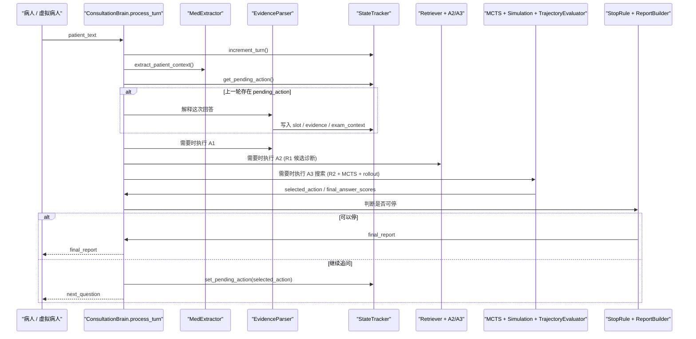

# brain 运行链路详解

这份文档专门回答一个问题：

从“病人说了一句话”开始，到系统决定“继续问什么”或“输出最终报告”为止，`brain/` 到底做了什么、按什么顺序调用了哪些函数、哪些状态会被更新。

适用范围：

- 实时问诊模式
- 命令行 demo
- 离线 replay / 虚拟病人自动对战

它们虽然入口不同，但真正的核心单轮处理都收敛到同一个函数：

- [`ConsultationBrain.process_turn()`](../brain/service.py)

## 1. 先记住一个总入口

对外部调用者来说，`brain` 最重要的接口只有两个：

1. `brain.start_session(session_id)`
2. `brain.process_turn(session_id, patient_text)`

也就是说，无论是前端、CLI，还是离线 replay，本质都在重复做下面这件事：

```python
brain.start_session(session_id)
result = brain.process_turn(session_id, patient_text)
```

`process_turn()` 的职责不是只做某一个论文模块，而是整轮编排：

- 读取当前会话状态
- 解析病人当前输入
- 如果上一轮已经问了一个问题，先把这次回答解释掉
- 决定是否跑 A1 / A2 / A3 / A4 / fallback
- 如果需要，执行局部树搜索和 rollout
- 判断是否可以停
- 如果不能停，生成下一问并把它登记成 `pending_action`

可以把它理解成整个问诊大脑的“单轮调度器”。

## 2. 外层是谁在调用它

### 2.1 实时前端

Streamlit 实时模式里，前端会先构建一个 brain，再在每次用户输入后调用：

- [`frontend/app.py`](../frontend/app.py) 中 `_run_live_turn()`
- `_run_live_turn()` -> `brain.process_turn(...)`

### 2.2 命令行 demo

- [`scripts/run_brain_demo.py`](../scripts/run_brain_demo.py)
- `main()` -> `build_default_brain_from_env()` -> `start_session()` -> 循环 `process_turn()`

### 2.3 离线 replay / 虚拟病人自动对战

离线评测时，外层不是人，而是虚拟病人代理：

- [`scripts/run_batch_replay.py`](../scripts/run_batch_replay.py)
- `_run_single_case()` -> `ReplayEngine.run_case()`
- [`simulator/replay_engine.py`](../simulator/replay_engine.py)
  - `patient_agent.open_case(case)` 生成首轮 opening
  - `brain.process_turn(session_id, opening_text)` 处理首轮
  - 然后循环：
    - 读取 `next_question`
    - `patient_agent.answer_question(...)`
    - 再把病人的回答送回 `brain.process_turn(...)`

所以从系统视角看，实时模式和离线 replay 唯一差别只是“谁来提供 `patient_text`”。

## 3. 先认识几个核心运行时对象

理解调用链之前，先记住这几个数据结构。它们定义在 [`brain/types.py`](../brain/types.py)。

### 3.1 `PatientContext`

这是病人这一轮原话经过 `MedExtractor` 结构化后的结果，主要包含：

- `general_info`
  - 年龄、性别、妊娠状态、既往史、流行病学史
- `clinical_features`
  - 这句话里提到的症状、风险因素、临床属性
- `raw_text`
  - 原始患者文本

它代表“这一轮病人刚刚说了什么”。

### 3.2 `SessionState`

这是整场问诊的全局状态，核心字段包括：

- `turn_index`
  - 当前是第几轮
- `slots`
  - 系统已经确认过的槽位事实
- `evidence_states`
  - A4 演绎后的证据状态
- `exam_context`
  - 检查有没有做过、做了什么、记得什么结果
- `candidate_hypotheses`
  - 当前候选诊断及其分数
- `asked_node_ids`
  - 已经问过的图谱节点，避免重复追问
- `trajectories`
  - 搜索过程中积累的 rollout 轨迹
- `metadata`
  - 运行时附加信息，比如 `pending_action`、`search_tree`、`last_search_result`

可以把它理解成“问诊大脑的长期记忆”。

### 3.3 `MctsAction`

这是系统准备问出去的一条“动作”，不一定都是普通症状问题，也可能是：

- `verify_evidence`
  - 直接验证某个证据点
- `collect_exam_context`
  - 先问某类检查做没做
- `collect_general_exam_context`
  - 更宽泛地问“最近有没有做过化验 / 影像 / 病原检查”
- `collect_chief_complaint`
  - 当前完全没线索，先补采主诉
- `probe_feature`
  - 冷启动时的全局探针问题

`process_turn()` 输出中的 `pending_action`，本质就是“系统刚刚选中的下一问”。

### 3.4 `SearchResult`

这是一次局部树搜索的中间结果，主要包括：

- `selected_action`
  - 搜索最后想问的动作
- `root_best_action`
  - repair 之前根节点原本最优动作
- `repair_selected_action`
  - verifier 拒停之后重新挑出来的修补动作
- `trajectories`
  - rollout 轨迹集合
- `final_answer_scores`
  - 每个候选最终答案的聚合评分
- `best_answer_id` / `best_answer_name`
  - 当前搜索看好的答案

### 3.5 `StopDecision`

这是“可不可以停”的结构化判断。系统里有两类 stop：

- 传统 sufficiency stop
  - 看 hypothesis 分数差距够不够大
- final answer accept stop
  - 看 trajectory 聚合评分、verifier、guarded gate 是否允许真正停止

## 4. 一张总图：单轮 `process_turn()` 做了什么



如果把这张图翻译成一句话，就是：

`process_turn()` 先消化“上一问的回答”，再基于最新状态决定“接下来该问什么”或“现在能不能停”。

## 5. 从病人一句话到系统输出：逐步拆解

下面按 `process_turn()` 的真实顺序来拆。

### 5.1 第 0 步：先有 session

每次会话开始时，外层必须先调用：

- `ConsultationBrain.start_session(session_id)`
- 实际写入器：[`StateTracker.create_session()`](../brain/state_tracker.py)

它会创建一个空的 `SessionState`，此时：

- `turn_index = 0`
- `slots = {}`
- `candidate_hypotheses = []`
- `exam_context` 会自动初始化出 `general/lab/imaging/pathogen` 四个入口

### 5.2 第 1 步：进入 `process_turn()`

调用链：

```text
ConsultationBrain.process_turn(session_id, patient_text)
  -> StateTracker.increment_turn()
```

做的第一件事是：

- 当前轮次 `turn_index + 1`

这一步很重要，因为后面很多逻辑都依赖轮次：

- 第 1 轮通常要跑 A1
- verifier 可能会因为 `turn_index` 太早而延后
- final answer acceptance 也会限制最早允许停止的轮次

### 5.3 第 2 步：把病人的原话先变成结构化上下文

调用链：

```text
process_turn()
  -> ingest_patient_turn()
  -> MedExtractor.extract_patient_context()
```

具体文件：

- [`brain/service.py`](../brain/service.py)
- [`brain/med_extractor.py`](../brain/med_extractor.py)

`MedExtractor.extract_patient_context()` 的逻辑是：

1. 如果看起来只是一个短答
   - 比如“有”“没有”“不太清楚”
   - 优先走规则，不调用 LLM
2. 否则如果 LLM 可用
   - 调用 `LlmClient.run_structured_prompt("med_extractor", ...)`
3. 如果 LLM 不可用或失败
   - 回退到规则抽取

输出的是 `PatientContext`。

这一步的作用不是直接决定诊断，而是统一把病人的一句话拆成：

- `P`：一般信息
- `C`：临床特征

### 5.4 第 3 步：先处理“这句话是不是在回答上一轮问题”

这是整个系统最容易误解、但也最关键的一步。

`process_turn()` 不会一上来就重新做 A1/A2/A3。它会先问自己：

- 当前会话里有没有 `pending_action`？

调用链：

```text
process_turn()
  -> update_from_pending_action()
  -> StateTracker.get_pending_action()
```

分三种情况。

#### 情况 A：没有 `pending_action`

说明这是：

- 首轮病人主动陈述
- 或者外层直接给了一句新的自由叙述

这时 `update_from_pending_action()` 直接返回：

- `a4_result = None`
- `route_after_a4 = None`
- `a4_updates = []`

系统会继续往下跑 A1 / A2 / A3。

#### 情况 B：上一轮动作是 `collect_chief_complaint`

也就是系统上轮问的是：

- “请先告诉我这次主要哪里不舒服……”

这时不会做目标证据解释，而是：

- 清掉 `pending_action`
- 在 metadata 里记录 `last_answered_action`
- 直接返回一个路由：
  - `RouteDecision(stage="A1")`

意思是：

- 这轮病人终于开始正式讲病情了
- 重新进入 A1 提取关键线索

#### 情况 C：上一轮动作是检查上下文类动作

动作类型包括：

- `collect_exam_context`
- `collect_general_exam_context`

调用链：

```text
update_from_pending_action()
  -> _update_from_exam_context_action()
  -> EvidenceParser.interpret_exam_context_answer()
  -> EvidenceParser.build_slot_updates_from_exam_context()
  -> StateTracker.update_exam_context()
  -> _apply_exam_context_evidence_feedback()
```

这里系统不是在问“有没有发热”，而是在问：

- 做没做过某类检查
- 做过哪些检查
- 记不记得大概结果

它会做几件事：

1. 解析检查可用性
   - `availability = done / not_done / unknown`
2. 提取病人提到的检查名
3. 提取病人提到的检查结果
4. 更新 `session_state.exam_context`
5. 如果说出的结果可以映射到具体图谱证据节点
   - 再转成 `SlotUpdate`
   - 写入 `slots`
   - 同时生成 `EvidenceState`
   - 并反馈给 hypothesis 分数
6. 如果病人只说“做过”，但没说清结果
   - 额外构造一次 `exam_context_followup_action`
   - 下一轮优先追问具体结果

这一步最后会构造一个兼容 A4 的 `A4DeductiveResult`，但语义是：

- “关于检查上下文，我已经知道你做没做过 / 做了什么”

它不是普通症状证据的 yes/no 解释。

#### 情况 D：上一轮动作是普通验证动作

这是最常见的情况，动作通常是：

- `verify_evidence`
- 或者冷启动时的 `probe_feature`

调用链：

```text
update_from_pending_action()
  -> EvidenceParser.interpret_answer_for_target()
  -> EvidenceParser.build_slot_updates_from_a4()
  -> StateTracker.apply_slot_updates()
  -> StateTracker.set_evidence_state()
  -> _apply_hypothesis_feedback()
  -> HypothesisManager.apply_evidence_feedback()
  -> EvidenceParser.judge_deductive_result()
  -> ReasoningRouter.decide_next_stage()
```

这里发生的是“真正意义上的 A4 + 路由”。

具体拆开看：

1. `interpret_answer_for_target()`
   - 目标感知地解释当前回答
   - 不是泛泛判断“病人这句话是肯定还是否定”
   - 而是判断“这句话对上一轮那个目标证据点意味着什么”
   - 输出：
     - `existence = exist / non_exist / unknown`
     - `certainty = confident / doubt / unknown`
     - `supporting_span / negation_span / uncertain_span`

2. `build_slot_updates_from_a4()`
   - 把 A4 结果翻译成 `SlotUpdate`
   - 例如：
     - `exist + confident -> status=true, certainty=certain`
     - `non_exist + doubt -> status=false, certainty=uncertain`

3. `StateTracker.apply_slot_updates()`
   - 写入 `SessionState.slots`

4. 构造 `EvidenceState`
   - 这和 `SlotState` 不完全一样
   - `SlotState` 更像问诊事实表
   - `EvidenceState` 更像“这个证据节点经过 A4 解释后的演绎结论”

5. `_record_a4_evidence_audit()`
   - 把这轮 A4 解释写入审计历史
   - 方便后续排查“明明问到了，为什么 guarded gate 没认”

6. `_apply_hypothesis_feedback()`
   - 调用 `HypothesisManager.apply_evidence_feedback()`
   - 对当前 hypothesis 分数做增减权

7. `_record_action_reward()`
   - 给 MCTS 的 `action_stats` 记录 reward

8. `judge_deductive_result()`
   - 用规则或 LLM judge 生成 `DeductiveDecision`
   - 回答的问题是：
     - 这条证据支持当前假设吗？
     - 是否应切回 A2？
     - 还是继续 A3？
     - 是否建议停止当前路径？

9. `ReasoningRouter.decide_next_stage()`
   - 把 `DeductiveDecision` 转成下一阶段路由

这一整段非常关键，因为它代表系统不是每轮都“从零思考”，而是：

- 先把“刚收到的回答”写回状态
- 再在更新后的状态上继续搜索

### 5.5 第 4 步：对 A4 的“直接 STOP 倾向”做一次 gate

调用链：

```text
process_turn()
  -> _gate_route_after_a4()
```

这一步的核心思想是：

- A4 即使觉得“当前路径已经很像可以停”
- 也不会马上真的停
- 系统会把这个 STOP 倾向先降级成继续 A3
- 然后交给：
  - search
  - trajectory evaluator
  - verifier
  - guarded gate
  做第二次确认

也就是说：

- A4 的 STOP 只是“局部路径层面想停”
- 真正停不停，要由后面的全局 acceptance 机制决定

### 5.6 第 5 步：决定本轮是否跑 A1

调用链：

```text
process_turn()
  -> should_run_a1 = 首轮 或 route_after_a4.stage == "A1"
  -> EvidenceParser.run_a1_key_symptom_extraction()
  -> EvidenceParser.build_slot_updates_from_a1()
```

规则很简单：

- 第 1 轮通常跑 A1
- 如果上一轮 A4 / 路由认为需要回到 A1，也会再跑

A1 的作用是：

- 从当前这句话里找关键线索
- 尤其适用于首轮病人主动叙述

A1 输出的是 `A1ExtractionResult`，然后会被转成一批 `SlotUpdate` 写回状态。

注意：

- A1 更新的是“基于这句话直接提取出的显式线索”
- A4 更新的是“针对上一轮目标问题解释出来的证据结论”

这两个都可能写进 `slots`，但来源不同。

### 5.7 第 6 步：做实体链接

调用链：

```text
process_turn()
  -> EntityLinker.link_clinical_features()
  -> EntityLinker.link_mentions()
```

实体链接的输入主要来自：

- `patient_context.clinical_features`

它会去 Neo4j 里找最像的节点，生成 `LinkedEntity`。

这些链接结果主要服务于后面的 R1：

- 用病人说出来的症状 / 风险 / 属性去反查候选诊断

### 5.8 第 7 步：根据当前状态决定“本轮主舞台”在哪

调用链：

```text
process_turn()
  -> router.route_after_slot_update(state)
```

`ReasoningRouter.route_after_slot_update()` 的逻辑很朴素：

- 如果一个槽位都没有
  - 去 A1
- 如果已有槽位但没有 hypothesis
  - 去 A2
- 如果已有 hypothesis
  - 去 A3

然后 `process_turn()` 会结合：

- `route_after_a4`
- `route_after_slot_update`

算出本轮的 `effective_stage`。

这代表：

- 不是每轮都固定 A1 -> A2 -> A3 全跑
- 而是会根据当前状态跳过某些阶段

### 5.9 第 8 步：先处理几个特殊分支

在进入正常 A2/A3 前，`process_turn()` 会先看几个特殊情况。

#### 分支 1：检查上下文 follow-up 优先

如果上一轮只是知道“做过检查”，但没说清结果，系统会优先追问这个结果。

调用：

- `_pop_exam_context_followup_action()`

这会让下一问直接变成：

- “你刚才提到做过 CT，报告里有没有提到磨玻璃影……”

#### 分支 2：病人一直没说出任何有效主诉

如果当前输入没有临床信息：

- `_should_collect_chief_complaint()`

系统会构造一个：

- `collect_chief_complaint` 动作

如果已经追问过一次主诉，病人还是没有给任何可用信息：

- `_should_stop_after_repeated_chief_complaint()`
- `_build_repeated_chief_complaint_stop_decision()`

系统会停止重复 intake，避免死循环。

#### 分支 3：进入 fallback

如果路由决定当前进入 `FALLBACK`：

- 用 `QuestionSelector.select_next_question()`
- 从 `GraphRetriever.get_cold_start_questions()` 中选一个全局优先问题

这条路径不依赖已有 hypothesis，是兜底问法。

### 5.10 第 9 步：需要时执行 A2

如果没有进入特殊分支，且当前阶段允许做 A2/A3，系统会决定是否重跑 A2。

调用链：

```text
process_turn()
  -> _should_refresh_a2()
  -> _run_a2()
  -> GraphRetriever.retrieve_r1_candidates()
  -> HypothesisManager.run_a2_hypothesis_generation()
  -> StateTracker.set_candidate_hypotheses()
```

#### 什么时候会真的重跑 A2

`_should_refresh_a2()` 的规则是：

- 当前还没有 hypothesis -> 一定跑
- `effective_stage == "A2"` -> 一定跑
- 本轮确实重新跑了 A1，且 A1 抽出了新 key features -> 跑

否则：

- 沿用上一轮已有的 hypothesis 排名
- `_build_cached_a2_result()`

这意味着系统在 A3 常规追问阶段不会每轮都重复做一次 A2。

#### R1 是怎么把症状变成候选诊断的

`GraphRetriever.retrieve_r1_candidates()` 会收集阳性特征来源：

- A1 `key_features`
- 实体链接结果
- 当前 `slots` 里已知为 true 的项目

然后去 Neo4j 查：

- 哪些 `Disease` 和这些特征有 `MANIFESTS_AS / HAS_LAB_FINDING / HAS_IMAGING_FINDING / HAS_PATHOGEN / RISK_FACTOR_FOR ...` 关系

最后给每个候选病打语义分：

- 匹配了多少特征
- 关系方向置信度
- 实体链接相似度
- 关系特异性
- 单一泛化特征惩罚

#### A2 是怎么从 R1 候选里选主假设的

`HypothesisManager.run_a2_hypothesis_generation()` 会：

1. 先按 R1 分数排序
2. 做一层竞争性重排
3. 如果 LLM 可用
   - 调用 `a2_hypothesis_generation` prompt
   - 产出：
     - `primary_hypothesis`
     - `alternatives`
     - `supporting_features`
     - `conflicting_features`
     - `recommended_next_evidence`
4. 如果 LLM 不可用
   - 直接用排序结果的 top1 / topK

最后会把候选诊断列表写回：

- `SessionState.candidate_hypotheses`

### 5.11 第 10 步：需要时执行 A3 搜索

这是 `brain` 里最“核心算法”的部分。

只有当满足两个条件时才会走进去：

- `effective_stage in {"A2", "A3"}`
- 当前已经有候选 hypothesis

调用链：

```text
process_turn()
  -> run_reasoning_search()
  -> choose_next_question_from_search()
```

下面拆开看。

## 6. `run_reasoning_search()` 内部到底发生了什么

### 6.1 先确保这场会话有一棵搜索树

调用链：

```text
run_reasoning_search()
  -> _ensure_search_tree()
  -> StateTracker.get_bound_search_tree()
  -> MctsEngine.build_state_signature()
```

这里会比较：

- 当前状态签名
- 当前 top1 hypothesis id
- 旧树根节点对应的签名

如果状态没明显变化，就复用旧树。

如果发生这些情况之一，就会 reroot / 重建树：

- top hypothesis 变了
- verifier repair 要求强制刷新
- 当前状态签名发生变化

根节点 metadata 里会保存一个轻量版 `rollout_state`，供后续 rollout 使用。

### 6.2 进入 rollout 循环

主循环大致是：

```text
for rollout_idx in range(num_rollouts):
    leaf = select_leaf(tree)
    rollout_context = _build_rollout_context_from_leaf(...)
    actions = _expand_actions_for_leaf(...)
    child_nodes = expand_node(...)
    for child in child_nodes:
        trajectory = rollout_from_tree_node(...)
        save_trajectory(...)
        backpropagate(...)
```

#### 6.2.1 `select_leaf()`

调用：

- `MctsEngine.select_leaf(tree)`

它沿着显式搜索树按 tree-policy 选当前最值得扩展的叶子。

依据主要是：

- 节点平均价值
- prior score
- exploration bonus
- 是否未访问

#### 6.2.2 从叶子恢复 rollout 上下文

调用：

- `_build_rollout_context_from_leaf()`

它会恢复：

- 一个可修改的 `rollout_state`
- 当前这条分支的 `current_hypothesis`
- `alternatives`

这里使用的是轻量状态快照，而不是整棵会话深拷贝，目的就是避免搜索树和最近搜索结果递归复制。

#### 6.2.3 扩展当前叶子的下一批动作

调用链：

```text
_expand_actions_for_leaf()
  -> GraphRetriever.retrieve_r2_expected_evidence()
  -> ActionBuilder.build_verification_actions()
```

这一步回答的问题是：

- “如果当前主假设是 X，接下来最值得验证哪些证据？”

#### R2 检索做了什么

`retrieve_r2_expected_evidence()` 会从当前 hypothesis 出发，在 Neo4j 里查和它相连的证据节点：

- `ClinicalFinding`
- `LabFinding`
- `LabTest`
- `ImagingFinding`
- `Pathogen`
- `ClinicalAttribute`
- `RiskFactor`
- `PopulationGroup`

并过滤掉：

- 已经问过的
- 当前状态里已经知道的

每条候选证据会附带很多元信息：

- `relation_type`
- `priority`
- `contradiction_priority`
- `question_type_hint`
- `acquisition_mode`
- `evidence_cost`

#### ActionBuilder 为什么不总是直接产出 `verify_evidence`

`ActionBuilder.build_verification_actions()` 会进一步把 R2 候选改造成系统真实能问的动作。

它会考虑：

- 当前证据是低成本直接询问，还是高成本检查
- 这个证据对区分当前主假设和备选假设的 `discriminative_gain`
- 是否命中 hypothesis 或 verifier 推荐补证据列表
- 是否和备选诊断重叠过高
- 患者负担 `patient_burden`

特别重要的一点：

如果某个证据是高成本检查项，系统通常不会直接问：

- “你有没有 β-D 葡聚糖升高？”

而是先折叠成检查上下文动作：

- “最近有没有做过这类检查？”

也就是：

- `collect_exam_context`
- `collect_general_exam_context`

### 6.3 把动作扩展成搜索树子节点

调用：

- `MctsEngine.expand_node()`

每个动作会变成一个 `TreeNode`，子节点 metadata 里会挂上：

- 对应 `MctsAction`
- hypothesis id
- target node id / name
- prior score

### 6.4 对每个子节点做多步 rollout

调用：

- `SimulationEngine.rollout_from_tree_node()`

这是整套 MCTS 里最像“论文推演”的部分。

它不是简单给当前动作估一个分，而是模拟：

- 先问这个动作
- 病人可能怎么回答
- A4 会怎么解释
- route 会导向 A2 还是 A3
- 下一步还会问什么

直到：

- 达到最大深度
- 路径终止
- 或没有后续动作可选

#### rollout 里每一步都会做什么

在 `while action is not None and step_depth < max_depth` 循环里，会反复执行：

1. `simulate_action(action, rollout_state, hypothesis)`
   - 估计 positive / negative / doubtful 三个分支收益
2. `_build_branch_payloads()`
   - 生成三种假想回答
3. 选加权收益最高的一支
4. `router.build_deductive_decision(branch_result, action, rollout_state)`
   - 判断这条分支会导向 A2、A3 还是 STOP
5. `_apply_rollout_state_update(...)`
   - 把这次假想回答写入 rollout_state
6. `_advance_hypothesis_after_route(...)`
   - 如果路由提示 hypothesis 要切换，就在 rollout 内切换
7. `_select_follow_up_action(...)`
   - 再次调用 retriever + action_builder 选下一步动作

最后会产出一条 `ReasoningTrajectory`，里面保留了：

- `A3` 步
- `A4` 步
- `ROUTE` 步
- 最终收敛到哪个答案
- 轨迹分数

### 6.5 把 rollout 结果写回树和会话

每条 trajectory 回来后，`run_reasoning_search()` 会做三件事：

1. `tracker.save_trajectory(session_id, trajectory)`
   - 写进会话长期轨迹列表
2. `mcts_engine.backpropagate(tree, child.node_id, trajectory.score)`
   - 从子节点一路回传到根
3. 如果 trajectory 表示路径终止
   - 把对应树节点 `mark_terminal()`

### 6.6 聚合“最终答案分组”

当所有 rollout 跑完后，搜索并不会只看“哪一个动作最优”，还会看：

- 这些 rollout 最终分别收敛到了哪些答案

调用链：

```text
run_reasoning_search()
  -> TrajectoryEvaluator.group_by_answer()
  -> TrajectoryEvaluator.score_groups()
  -> TrajectoryEvaluator.select_best_answer()
```

#### `group_by_answer()`

按 `(answer_id, answer_name)` 把 trajectory 分组。

#### `score_groups()`

对每个答案组计算：

- `consistency`
  - 这个答案占全部 trajectory 的比例
- `diversity`
  - 同一个答案组内，路径是否不是完全重复
- `agent_evaluation`
  - 启发式或 LLM verifier 评审分

最后得到：

- `FinalAnswerScore.final_score`

#### `agent_evaluation` 的两种模式

1. `fallback`
   - 直接用 trajectory 平均分等启发式指标
2. `llm_verifier`
   - 调用 `trajectory_agent_verifier` prompt
   - 让 LLM 从临床角度判断：
     - 这个答案证据够不够
     - 还有没有关键缺失证据
     - 是否有强替代诊断没排掉
     - 下一步应该补什么证据

为了控制成本，verifier 还有延后机制：

- 轮次太早不跑
- trajectory 数太少不跑

### 6.7 从树根子节点选“下一问”

调用：

- `MctsEngine.select_root_action()`

它会从根节点的子节点里选：

- 平均价值最高
- visit 较多
- prior 也不差

的动作作为当前真正要问出去的下一问。

### 6.8 `SearchResult` 最后装了什么

`run_reasoning_search()` 最终把以下内容塞进 `SearchResult`：

- `selected_action`
- `root_best_action`
- `trajectories`
- `final_answer_scores`
- `best_answer_id`
- `best_answer_name`
- `tree_node_count`
- `rollouts_executed`
- `tree_refresh`

并把它写进：

- `session_state.metadata["last_search_result"]`

## 7. 搜索结束后，系统怎么决定“停”还是“继续问”

搜索跑完后，`process_turn()` 不会立刻把 `selected_action` 发出去，而是先走一层 stop / verifier / repair。

### 7.1 传统 sufficiency stop

调用：

- `StopRuleEngine.check_sufficiency()`

主要看：

- 只有一个 hypothesis 且分够高
- 或 top1 分数高且和 top2 差距够大

这是比较“传统”的停法。

### 7.2 基于 trajectory 的 final answer accept

调用链：

```text
best_answer_score = trajectory_evaluator.select_best_answer(...)
accept_decision = stop_rule_engine.should_accept_final_answer(...)
```

这里会进一步看：

- 当前轮次够不够晚
- trajectory_count 够不够多
- consistency 是否够高
- agent_eval_score 是否够高
- final_score 是否够高
- 如果启用了 `llm_verifier`
  - verifier 是否同意停

### 7.3 guarded gate

如果 acceptance profile 是 `guarded_lenient` 一类，系统还会额外检查：

- 已确认的关键证据家族够不够
- 有没有关键 hard negative
- 有没有还没排掉的强替代诊断

这一步发生在：

- `StopRuleEngine.should_accept_final_answer()`
- 内部 `_check_guarded_lenient_acceptance()`

所以一个很重要的现象是：

- LLM verifier 说“可以停”
- 不代表系统最后一定停

因为 guarded gate 还能拦一次。

### 7.4 verifier 拒停后为什么系统会“修补”而不是直接放弃

如果 `best_answer_score` 已经形成了，但 verifier 或 guarded gate 认为还不能停，系统会构造 repair context。

调用链：

```text
process_turn()
  -> _build_verifier_repair_context()
  -> _apply_verifier_repair_strategy()
  -> _choose_repair_action()
```

这三步分别做：

1. 提炼拒停原因
   - `missing_key_support`
   - `strong_alternative_not_ruled_out`
   - `strong_unresolved_alternative_candidates`
   - `hard_negative_key_evidence`
   - `trajectory_insufficient`
2. 根据拒停原因重排 hypothesis
3. 显式挑一个最适合“补证据缺口”的下一问

所以 repair 的本质不是重新开始，而是：

- “我大致知道答案是谁了，但现在还缺关键锚点或还没排干净竞争诊断，下一问要专门补这个洞。”

### 7.5 如果完全选不出动作怎么办

系统还有几层兜底：

1. 如果当前没有高价值动作，且相关检查又没做
   - `_build_exam_limited_stage_stop_decision()`
   - 输出阶段性判断
2. 如果搜索没有给出动作
   - `_choose_cold_start_probe_action()`
   - 退回全局冷启动问题

## 8. 最后返回给外层的结果里有什么

`process_turn()` 返回的是一个大字典，主要字段包括：

- `session_id`
- `turn_index`
- `patient_text`
- `patient_context`
- `linked_entities`
- `a1`
- `a2`
- `a2_evidence_profiles`
- `a3`
- `a4`
- `deductive_decision`
- `route_after_a4`
- `route_after_slot_update`
- `updates`
- `evidence_audit`
- `search_report`
- `next_question`
- `pending_action`
- `final_report`

最重要的判读规则是：

### 8.1 如果 `final_report is not None`

说明这一轮系统认为可以结束，外层应该展示最终结果，而不是继续追问。

### 8.2 如果 `final_report is None`

说明这一轮还没结束，外层应该取：

- `next_question`
- `pending_action`

并把下一轮病人的回答再送回 `process_turn()`。

### 8.3 `pending_action` 为什么这么关键

因为下一轮系统之所以知道病人这句话是在回答什么，就是靠它。

也就是说：

- 上一轮输出 `pending_action`
- 下一轮输入 `patient_text`
- `update_from_pending_action()` 用这两者配对

如果外层丢了 `pending_action` 语义，整个“问答闭环”就断了。

## 9. 四条最重要的真实调用链

下面把你最常见的四种路径单独写成“调用栈风格”。

### 9.1 路径一：首轮病人主动说主诉

典型输入：

- “发热三周，最近干咳、气促。”

调用链：

```text
外层（前端 / CLI / replay）
  -> start_session()
  -> process_turn(session_id, patient_text)
    -> increment_turn()
    -> MedExtractor.extract_patient_context()
    -> update_from_pending_action()  # 无 pending_action，直接返回
    -> EvidenceParser.run_a1_key_symptom_extraction()
    -> EvidenceParser.build_slot_updates_from_a1()
    -> StateTracker.apply_slot_updates()
    -> EntityLinker.link_clinical_features()
    -> _should_refresh_a2() == True
    -> _run_a2()
      -> GraphRetriever.retrieve_r1_candidates()
      -> HypothesisManager.run_a2_hypothesis_generation()
      -> StateTracker.set_candidate_hypotheses()
    -> run_reasoning_search()
      -> _ensure_search_tree()
      -> select_leaf()
      -> _expand_actions_for_leaf()
      -> rollout_from_tree_node() * N
      -> group_by_answer()
      -> score_groups()
      -> select_root_action()
    -> stop / verifier / repair
    -> build_a3_verification_result()
    -> mark_question_asked()
    -> set_pending_action()
    -> 返回 next_question
```

这一条路径的特点是：

- 先靠 A1 和 R1 建立初始诊断空间
- 再通过 A3/search 选出第一条真正的验证问题

### 9.2 路径二：病人在回答上一轮普通验证问题

典型场景：

- 上一轮问：“有没有干咳？”
- 这一轮答：“有，咳了两周。”

调用链：

```text
process_turn()
  -> increment_turn()
  -> MedExtractor.extract_patient_context()
  -> update_from_pending_action()
    -> get_pending_action()
    -> EvidenceParser.interpret_answer_for_target()
    -> EvidenceParser.build_slot_updates_from_a4()
    -> StateTracker.apply_slot_updates()
    -> StateTracker.set_evidence_state()
    -> HypothesisManager.apply_evidence_feedback()
    -> EvidenceParser.judge_deductive_result()
    -> ReasoningRouter.decide_next_stage()
  -> _gate_route_after_a4()
  -> 视路由结果决定是否再跑 A1 / A2
  -> 常见情况：直接进入 run_reasoning_search()
  -> 选出下一问或形成 final_report
```

这一条路径的特点是：

- A4 不只是“做解释”
- 它还会直接改 hypothesis 分数、改 route，并影响后续搜索树

### 9.3 路径三：病人在回答检查上下文问题

典型场景：

- 上一轮问：“最近有没有做过胸部 CT 或相关检查？”
- 这一轮答：“做过 CT，医生说有磨玻璃影。”

调用链：

```text
process_turn()
  -> increment_turn()
  -> MedExtractor.extract_patient_context()
  -> update_from_pending_action()
    -> _update_from_exam_context_action()
      -> EvidenceParser.interpret_exam_context_answer()
      -> StateTracker.update_exam_context()
      -> EvidenceParser.build_slot_updates_from_exam_context()
      -> _apply_exam_context_evidence_feedback()
      -> _build_a4_result_from_exam_context()
  -> 如果 exam_result.needs_followup:
       exam_context_followup_action 优先进入下一轮
     否则:
       继续 A2/A3/search
```

这一条路径的特点是：

- 先问“有没有做过检查”
- 再尽量把检查结果映射回具体图谱证据
- 必要时再追问一次更具体的结果

### 9.4 路径四：离线 replay

调用链：

```text
scripts/run_batch_replay.py
  -> _run_single_case()
    -> build_default_brain_from_env()
    -> VirtualPatientAgent(use_llm=True)
    -> ReplayEngine.run_case(case)
      -> brain.start_session(session_id)
      -> patient_agent.open_case(case)
      -> brain.process_turn(session_id, opening_text)
      -> while not final_report:
           -> 读取 current_output["next_question"]
           -> patient_agent.answer_question(question_node_id, question_text, case)
           -> brain.process_turn(session_id, answer_text)
      -> 如果 max_turns 到了还没结束:
           -> brain.finalize(session_id)
```

这一条路径和实时模式在 `brain` 内部没有区别，区别只在于：

- 病人文本来自 `VirtualPatientAgent`
- 系统自动循环追问直到终止

## 10. 为什么这个系统看起来“不是严格线性的 A1 -> A2 -> A3 -> A4”

因为真实实现是“单轮编排器 + 条件跳转”，不是论文名词的机械流水线。

更准确地说，它每轮都在做两件事：

1. 先消费上一轮动作的回答
2. 再根据新状态决定本轮接下来要进入哪个阶段

所以你会看到这些现象：

- 第一轮通常是 `A1 -> A2 -> A3`
- 后续大多数轮次更像：
  - `A4(解释上一问)` -> `A3(search 下一问)`
- 遇到强矛盾时会：
  - `A4` -> `A2`
- 输入几乎没有信息时会：
  - `collect_chief_complaint` -> `A1`
- verifier 拒停时会：
  - `repair` -> 再 `A3`

所以系统的真实节奏不是“阶段一次性跑完”，而是“围绕单轮问答不断在阶段之间切换”。

## 11. 如果你想顺着代码自己 trace，建议按这个顺序看

### 第一层：先看主调度器

1. [`brain/service.py`](../brain/service.py)
   - `ConsultationBrain.process_turn()`
   - `run_reasoning_search()`
   - `update_from_pending_action()`

### 第二层：再看状态和数据结构

2. [`brain/types.py`](../brain/types.py)
3. [`brain/state_tracker.py`](../brain/state_tracker.py)

### 第三层：看四个阶段对应模块

4. [`brain/med_extractor.py`](../brain/med_extractor.py)
5. [`brain/evidence_parser.py`](../brain/evidence_parser.py)
6. [`brain/hypothesis_manager.py`](../brain/hypothesis_manager.py)
7. [`brain/action_builder.py`](../brain/action_builder.py)
8. [`brain/router.py`](../brain/router.py)

### 第四层：看搜索与终止逻辑

9. [`brain/retriever.py`](../brain/retriever.py)
10. [`brain/mcts_engine.py`](../brain/mcts_engine.py)
11. [`brain/simulation_engine.py`](../brain/simulation_engine.py)
12. [`brain/trajectory_evaluator.py`](../brain/trajectory_evaluator.py)
13. [`brain/stop_rules.py`](../brain/stop_rules.py)
14. [`brain/report_builder.py`](../brain/report_builder.py)

### 第五层：最后看外层驱动

15. [`frontend/app.py`](../frontend/app.py)
16. [`simulator/replay_engine.py`](../simulator/replay_engine.py)
17. [`simulator/patient_agent.py`](../simulator/patient_agent.py)

## 12. 调试时最值得看的状态字段

如果后面你要自己 debug，一般先盯下面这些字段最有效：

- `session_state.metadata["pending_action"]`
  - 下一轮到底在回答什么
- `session_state.metadata["last_answered_action"]`
  - 刚刚消化掉的是哪一个动作
- `session_state.metadata["last_search_result"]`
  - 最近一次搜索到底选了什么
- `session_state.metadata["last_tree_refresh"]`
  - 搜索树这一轮有没有 reroot，为什么
- `session_state.metadata["a4_evidence_audit_history"]`
  - A4 怎么解释每一条回答
- `session_state.metadata["verifier_repair_context"]`
  - verifier 拒停后系统为什么改问法
- `session_state.metadata["last_guarded_acceptance_features"]`
  - guarded gate 在看哪些关键证据家族
- `search_report.final_answer_scores`
  - 当前每个答案组的 consistency / diversity / agent_eval / final_score

## 13. 一句话总结整个 brain 的真实工作方式

`brain` 不是“收到一句话就直接给诊断”的单步模型，而是一个以 `process_turn()` 为核心的多轮状态机：

- 用 `MedExtractor` 和 `A1` 理解当前输入
- 用 `pending_action + A4` 消化上一轮答案
- 用 `R1 + A2` 维护候选诊断
- 用 `R2 + MCTS + rollout` 选择下一问
- 用 `trajectory evaluator + verifier + guarded gate` 决定能否停止

如果把整个系统压缩成一句最接近源码真相的话，就是：

- “每一轮先更新状态，再基于更新后的状态做下一步搜索和停止判断。”
