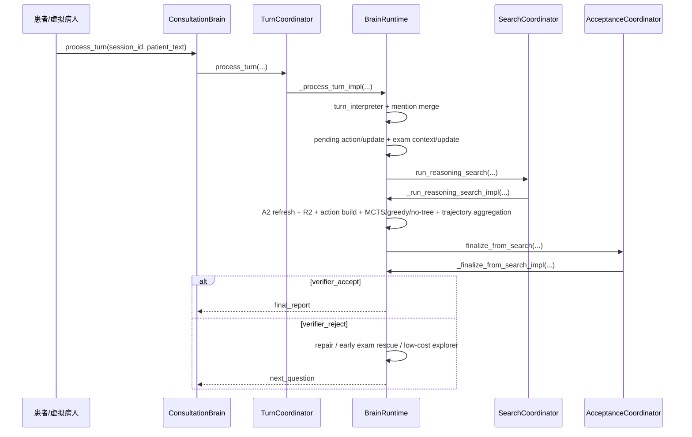

# brain 运行链路详解

本文档对应当前重构后的 `brain/` 真实代码，而不是早期的平铺模块版本。现在的稳定外部入口仍然是：

- [brain/service.py](/Users/loki/Workspace/GraduationDesign/brain/service.py)
  - 只保留公共导出与稳定调用面
- [brain/app/brain.py](/Users/loki/Workspace/GraduationDesign/brain/app/brain.py)
  - `ConsultationBrain` 薄门面
  - `BrainRuntime` 运行时实现
- 协调器入口：
  - [brain/turn/coordinator.py](/Users/loki/Workspace/GraduationDesign/brain/turn/coordinator.py)
  - [brain/search/coordinator.py](/Users/loki/Workspace/GraduationDesign/brain/search/coordinator.py)
  - [brain/acceptance/coordinator.py](/Users/loki/Workspace/GraduationDesign/brain/acceptance/coordinator.py)

它主要回答 5 个问题：

- 现在 `brain/` 的目录到底怎么分层
- 一轮问诊从 `process_turn()` 进入后，会经过哪些对象和阶段
- `A1 / A2 / A3`、`pending action`、`trajectory evaluator`、`verifier / repair` 各自放在哪一层
- 当前最关键的运行时对象是什么
- 如果出现重复提问、候选排序异常、verifier 拒停或检查空转，应该先看哪里

## 1. 当前目录结构

当前 `brain/` 已按“运行阶段优先”的方式重组为 9 个子包：

- [brain/app](/Users/loki/Workspace/GraduationDesign/brain/app)
  - 门面、依赖装配、默认构造、配置读取
- [brain/turn](/Users/loki/Workspace/GraduationDesign/brain/turn)
  - 本轮解释、A1、pending action 回答消化、exam context 处理
- [brain/search](/Users/loki/Workspace/GraduationDesign/brain/search)
  - `R1 / R2` 检索、A2、A3、MCTS、rollout、trajectory evaluator、fallback
- [brain/acceptance](/Users/loki/Workspace/GraduationDesign/brain/acceptance)
  - verifier acceptance 与最终是否 completed 的控制
- [brain/state](/Users/loki/Workspace/GraduationDesign/brain/state)
  - 会话状态、动作/轨迹/结果 dataclass、state tracker、anchor、state signature
- [brain/integrations](/Users/loki/Workspace/GraduationDesign/brain/integrations)
  - Neo4j / LLM / entity linker
- [brain/reporting](/Users/loki/Workspace/GraduationDesign/brain/reporting)
  - 阶段报告、搜索报告、最终报告
- [brain/shared](/Users/loki/Workspace/GraduationDesign/brain/shared)
  - 错误定义、名称归一化
- [brain/config](/Users/loki/Workspace/GraduationDesign/brain/config)
  - 默认配置路径与配置读取入口

需要特别记住两点：

1. `brain/service.py` 现在只是稳定入口，不再承载实现细节。
2. `brain/types.py` 和 `brain/session_dag.py` 已删除。
   - 类型现已拆到 [brain/state/runtime.py](/Users/loki/Workspace/GraduationDesign/brain/state/runtime.py) 与 [brain/state/results.py](/Users/loki/Workspace/GraduationDesign/brain/state/results.py)
   - `session_dag` 不再属于当前运行链路

## 2. 外部稳定入口

当前对外仍保留 3 个最重要的稳定调用面：

1. `build_default_brain_from_env()`
2. `ConsultationBrain.process_turn(session_id, patient_text)`
3. `ConsultationBrain.finalize(session_id)`

其中：

- [brain/service.py](/Users/loki/Workspace/GraduationDesign/brain/service.py) 负责把这些入口稳定暴露给 frontend / replay / scripts
- [brain/app/brain.py](/Users/loki/Workspace/GraduationDesign/brain/app/brain.py) 里的 `ConsultationBrain` 只做门面：
  - `process_turn()` 委托给 `TurnCoordinator`
  - `run_reasoning_search()` 委托给 `SearchCoordinator`
  - `finalize()` / `finalize_from_search()` 委托给 `AcceptanceCoordinator`
- 真正的大量实现细节仍由 `BrainRuntime` 保存，便于既维持旧测试契约，又把阅读入口按阶段收拢

## 3. 单轮主链总图


```mermaid
sequenceDiagram
    participant U as 患者/虚拟病人
    participant F as ConsultationBrain
    participant T as TurnCoordinator
    participant R as BrainRuntime
    participant S as SearchCoordinator
    participant V as AcceptanceCoordinator

    U->>F: process_turn(session_id, patient_text)
    F->>T: process_turn(...)
    T->>R: _process_turn_impl(...)
    R->>R: turn_interpreter + mention merge
    R->>R: pending action/update + exam context/update
    R->>S: run_reasoning_search(...)
    S->>R: _run_reasoning_search_impl(...)
    R->>R: A2 refresh + R2 + action build + MCTS/greedy/no-tree + trajectory aggregation
    R->>V: finalize_from_search(...)
    V->>R: _finalize_from_search_impl(...)
    alt verifier_accept
        R-->>F: final_report
    else verifier_reject
        R->>R: repair / early exam rescue / low-cost explorer
        R-->>F: next_question
    end
```

这张图对应当前真实代码里的 3 层职责：

- `TurnCoordinator`
  - 是单轮入口壳
- `SearchCoordinator`
  - 是 A2/A3 搜索壳
- `AcceptanceCoordinator`
  - 是最终接受/拒停收口壳

## 4. `process_turn()` 现在实际做什么

当前 `ConsultationBrain.process_turn()` 的外观很薄，但底层 `BrainRuntime._process_turn_impl()` 仍按下面的顺序组织单轮逻辑。

### 4.1 读取真实会话状态

先由 `StateTracker` 读出会话状态并递增 turn：

- [brain/state/tracker.py](/Users/loki/Workspace/GraduationDesign/brain/state/tracker.py)

当前真实全局状态只认 [brain/state/runtime.py](/Users/loki/Workspace/GraduationDesign/brain/state/runtime.py) 里的 `SessionState`，其中最关键的字段包括：

- `turn_index`
- `slots`
- `evidence_states`
- `mention_context`
- `exam_context`
- `candidate_hypotheses`
- `asked_node_ids`
- `metadata`

### 4.2 统一解释本轮患者回答

接着进入 [brain/turn/parser.py](/Users/loki/Workspace/GraduationDesign/brain/turn/parser.py)：

- `interpret_turn()`
  - 统一产出 `mentions`
- `build_patient_context_from_turn()`
  - 基于同一份 `mentions` 派生 `PatientContext`
- `run_a1_key_symptom_extraction()`
  - 生成 `A1ExtractionResult`

这里的关键约束是：

- 当前是 `LLM-first`
- 一轮长回答只解释一次
- `mention_state` 统一使用 `present / absent / unclear`
- 不再在不同阶段为同一句患者回答反复跑多套抽取器

### 4.3 generic merge 与 pending action merge

统一解释结束后，`BrainRuntime` 会先做通用状态写回：

- mentions -> `SlotUpdate`
- mentions -> `EvidenceState`
- mentions -> `mention_context`

如果上一轮还挂着 `pending_action`，还会额外做一层目标感知消化：

- `derive_pending_action_result()`
- `update_from_pending_action()`
- `exam_context` 相关 follow-up merge

这一层负责把“病人这句回答是不是在回答上一轮具体问题”变成结构化结果：

- `PendingActionResult`
- `PendingActionDecision`

### 4.4 进入搜索前的真实证据信任补写

在真正进入搜索前，当前实现会先执行：

- `BrainRuntime._trust_patient_stated_evidence()`

作用是：

- 如果患者在 opening 或历史回答里已经明确说过某条图谱证据
- 且这条证据与当前 top hypotheses 的 `R2` 节点语义对上
- 就直接补成 graph-grounded `evidence_state`
- 同时从后续追问动作池里移除，避免重复提问

这一步是当前“减少重复确认”的关键。

### 4.5 一个从首句症状到最终诊断的完整函数调用例子

下面用一个方便打断点的例子串起来看整条主链。假设：

- 当前已经通过 `build_default_brain_from_env()` 构造出 `ConsultationBrain`
- `session_id = "demo_pcp_case"`
- 当前配置允许正常跑 `A2 + A3 + search`
- 病人首句是：`“我最近发热、干咳，活动后呼吸困难。”`
- 后续又补充：`“做过胸部 CT，报告说双肺磨玻璃影。”`
- 再补充：`“CD4 很低，血氧也有点低。”`

这个例子里，最终候选可能收敛到 `肺孢子菌肺炎`，但要注意两点：

- 具体问哪一个问题，仍会受 `root_action_mode = mcts | greedy | no_tree_greedy` 影响
- 下面写的是“真实函数链怎么走”，不是承诺每次都会得到完全一样的提问文本

#### 4.5.1 第 0 步：创建会话

通常先走：

- `build_default_brain_from_env()`
- `ConsultationBrain.start_session("demo_pcp_case")`
- `BrainRuntime.start_session()`
- `StateTracker.create_session()`

这一步结束后，会得到一份初始 `SessionState`。后面所有轮次都只围绕这份状态读写。

#### 4.5.2 第 1 轮：病人第一次说出症状

外部入口是：

- `ConsultationBrain.process_turn(session_id, patient_text)`
- `TurnCoordinator.process_turn(...)`
- `BrainRuntime._process_turn_impl(...)`

这一轮里最值得打断点的顺序是：

1. `tracker.increment_turn(session_id)`
2. `tracker.get_pending_action(session_id)`
   - 首轮通常是 `None`
3. `_collect_known_feature_names(session_id)`
4. `self.deps.evidence_parser.interpret_turn(patient_text, pending_action=None)`
   - 把“发热 / 干咳 / 活动后呼吸困难”抽成统一 `mentions`
5. `_normalize_no_result_mentions_for_pending_action(...)`
   - 首轮一般不会改太多，但它是后面“检查没做过”和“检查阴性”分流的关键入口
6. `_prepare_turn_mentions(...)`
   - 内部会调用 `entity_linker.link_mention_items(...)` 或 `link_clinical_features(...)`
7. `self.deps.evidence_parser.build_patient_context_from_turn(...)`
8. `self.deps.evidence_parser.run_a1_key_symptom_extraction(...)`
9. `_build_slot_updates_from_mentions(...)`
10. `tracker.merge_mention_items(...)`
11. `tracker.apply_slot_updates(...)`
12. `_apply_generic_evidence_states_from_mentions(...)`
13. `_mark_a2_refresh_if_strong_updates(...)`
14. `update_from_pending_action(...)`
    - 首轮没有上一轮问题，所以这里大多只返回空的 `PendingActionResult`
15. `_gate_pending_action_route(...)`
16. `self.deps.router.route_after_slot_update(...)`
17. `_should_refresh_a2(...)`
18. `_run_a2(...)`
    - 这里开始把首轮症状送进 `R1 / A2`，形成第一批候选诊断
19. `_run_reasoning_search_impl(...)`
20. `_choose_next_question_from_search_impl(...)`

如果这一轮 verifier 还不允许停，后半段会继续走：

1. `self.deps.trajectory_evaluator.select_best_answer(...)`
2. `self.deps.acceptance_controller.should_accept_final_answer(...)`
3. `_build_verifier_repair_context(...)`
4. `_apply_verifier_repair_strategy(...)`
   - 只有 verifier 明确拒停时才更关键
5. `_choose_repair_action(...)` 或沿用 `default_search_action`
6. `_maybe_choose_early_exam_context_rescue_action(...)`
7. `_maybe_choose_low_cost_explorer_action(...)`
8. `_filter_selected_action_for_repeat(...)`
9. `self.deps.action_builder.build_a3_verification_result(...)`
10. `_record_asked_question(...)`
11. `tracker.mark_question_asked(...)`
12. `tracker.set_pending_action(...)`

于是第 1 轮通常会返回：

- `next_question`
- `pending_action`
- `search_report`

例如系统可能问：`“有没有做过胸部 CT 或血氧检查？”`

#### 4.5.3 第 2 轮：病人在回答上一轮挂起的问题

病人回复：`“做过胸部 CT，报告说双肺磨玻璃影。”`

入口仍然完全一样：

- `ConsultationBrain.process_turn(...)`
- `TurnCoordinator.process_turn(...)`
- `BrainRuntime._process_turn_impl(...)`

但这一轮最关键的分叉变成了 `pending_action` 消化：

1. `tracker.get_pending_action(session_id)`
   - 这次能取到上一轮登记的问题动作
2. `self.deps.evidence_parser.interpret_turn(patient_text, pending_action=pending_action)`
3. `update_from_pending_action(...)`

`update_from_pending_action(...)` 内部是这轮最值得细看的地方，它会把“这句话到底是不是在回答上一轮问题”拆成更细的结构：

1. `derive_pending_action_result(...)`
2. `_get_or_build_pending_action_evidence_state(...)`
3. `_enrich_pending_action_evidence_state(...)`
4. 把结果写回 `evidence_states / exam_context / slots / metadata`

如果这里识别成功，当前会话状态里就不再只是“病人有呼吸道症状”，而会多出接近图谱证据级别的信息，例如：

- 已做过影像检查
- 影像提示磨玻璃影
- 这条证据与某些候选诊断的 `R2` 证据节点可以对齐

之后 `_process_turn_impl()` 会继续走：

- `self.deps.router.route_after_slot_update(...)`
- `_should_refresh_a2(...)`
- `_run_a2(...)` 或 `_build_cached_a2_result(...)`
- `_run_reasoning_search_impl(...)`

如果 search 认为还缺关键支持，它可能再问：

- `“近期 CD4 水平怎样？”`
- 或 `“有没有低氧、静息呼吸困难加重？”`

这时新的 `selected_action` 又会通过 `tracker.set_pending_action(...)` 挂到下一轮。

#### 4.5.4 第 3 轮：补齐关键支持证据并进入终止判断

病人回复：`“CD4 很低，血氧也有点低。”`

入口仍然相同，但这一轮更容易触发“候选答案足够稳定，可以停”的路径：

1. `update_from_pending_action(...)`
   - 把 `CD4 低`、`低氧` 等信息消化进当前状态
2. `_trust_patient_stated_evidence(session_id)`
   - 如果病人已经自己说出了图谱里的关键证据，会在搜索前补成可信 `evidence_state`
3. `_run_reasoning_search_impl(...)`

`_run_reasoning_search_impl()` 内部会继续跑真实搜索主链：

1. `_ensure_search_tree(session_id, state)`
2. `self.deps.mcts_engine.select_leaf(tree)`
3. `_build_rollout_context_from_leaf(...)`
4. `tracker.increment_state_visit(...)`
5. `_expand_actions_for_leaf(...)`
6. `self.deps.mcts_engine.expand_node(...)`
7. `self.deps.simulation_engine.rollout_trajectories_from_tree_node(...)`
8. `tracker.save_trajectory(...)`
9. `self.deps.mcts_engine.backpropagate(...)`
10. `self.deps.trajectory_evaluator.group_by_answer(...)`
11. `_build_verifier_patient_context(...)`
12. `self.deps.trajectory_evaluator.score_groups(...)`
13. `self.deps.trajectory_evaluator.select_best_answer(...)`
14. `_select_root_action_with_policy(...)`

然后回到 `_process_turn_impl()` 做最后的接受判定：

1. `self.deps.acceptance_controller.should_accept_final_answer(...)`
2. `_build_verifier_repair_context(...)`
3. 如果 verifier 已接受，就不再挑下一问
4. `_should_emit_final_report(...)`
5. `_finalize_from_search_impl(session_id, search_result)`

#### 4.5.5 最终出诊断报告时实际怎么收口

当 `_process_turn_impl()` 发现本轮应该结束时，当前主链会直接调用：

- `BrainRuntime._finalize_from_search_impl(...)`

同时，对外门面也保留了等价收口入口：

- `AcceptanceCoordinator.finalize_from_search(...)`

`_finalize_from_search_impl(...)` 当前很短，但它是“最终答案真正落盘前”的最后收口点：

1. `state = tracker.get_session(session_id)`
2. `best_answer_score = self.deps.trajectory_evaluator.select_best_answer(...)`
3. `accept_decision = self.deps.acceptance_controller.should_accept_final_answer(...)`
4. `self.deps.report_builder.build_final_reasoning_report(...)`

于是这一轮 `process_turn()` 会直接返回：

- `next_question = None`
- `pending_action = None`
- `final_report != None`

也就是说，当前主链里“诊断结束”通常是在某一轮 `process_turn()` 内部自然收口的，而不是必须额外再调一次 `finalize()`。

#### 4.5.6 如果外层显式调用 `finalize()`，会走哪条链

有些 frontend / replay / 调试脚本会在会话末尾主动调用：

- `ConsultationBrain.finalize(session_id)`
- `AcceptanceCoordinator.finalize(session_id)`
- `BrainRuntime.finalize(session_id)`

这条链主要是兼容旧接口：

- 如果 `state.metadata["last_search_result"]` 里已经有上一轮 search 结果，就复用它生成最终报告
- 否则退回普通 `build_final_report(...)`

所以：

- 调“为什么这轮已经停了还没出 reasoning report”，优先看 `_process_turn_impl()` 和 `_finalize_from_search_impl()`
- 调“外层强制 finalize 为什么内容不完整”，再看 `BrainRuntime.finalize()`

#### 4.5.7 一眼能看懂的伪调用栈

```text
第 0 步：创建会话
build_default_brain_from_env
  -> ConsultationBrain.start_session
    -> BrainRuntime.start_session
      -> StateTracker.create_session

第 1 轮：首句症状
ConsultationBrain.process_turn
  -> TurnCoordinator.process_turn
    -> BrainRuntime._process_turn_impl
      -> EvidenceParser.interpret_turn
      -> BrainRuntime._prepare_turn_mentions
      -> EvidenceParser.build_patient_context_from_turn
      -> EvidenceParser.run_a1_key_symptom_extraction
      -> StateTracker.merge_mention_items / apply_slot_updates
      -> BrainRuntime.update_from_pending_action
      -> BrainRuntime._run_a2
      -> BrainRuntime._run_reasoning_search_impl
      -> TrajectoryEvaluator.select_best_answer
      -> VerifierAcceptanceController.should_accept_final_answer
      -> ActionBuilder.build_a3_verification_result
      -> StateTracker.set_pending_action

第 2 轮：回答上一轮问题
ConsultationBrain.process_turn
  -> TurnCoordinator.process_turn
    -> BrainRuntime._process_turn_impl
      -> EvidenceParser.interpret_turn(pending_action=...)
      -> BrainRuntime.update_from_pending_action
        -> derive_pending_action_result
        -> _get_or_build_pending_action_evidence_state
        -> _enrich_pending_action_evidence_state
      -> BrainRuntime._run_reasoning_search_impl
      -> StateTracker.set_pending_action

第 3 轮：关键证据补齐，允许终止
ConsultationBrain.process_turn
  -> TurnCoordinator.process_turn
    -> BrainRuntime._process_turn_impl
      -> BrainRuntime._trust_patient_stated_evidence
      -> BrainRuntime._run_reasoning_search_impl
        -> MctsEngine.select_leaf / expand_node / backpropagate
        -> SimulationEngine.rollout_trajectories_from_tree_node
        -> TrajectoryEvaluator.group_by_answer / score_groups / select_best_answer
      -> VerifierAcceptanceController.should_accept_final_answer
      -> BrainRuntime._finalize_from_search_impl
        -> ReportBuilder.build_final_reasoning_report
```

如果你现在要跟着断点排一遍，最省时间的入口顺序通常是：

1. `BrainRuntime._process_turn_impl()`
2. `BrainRuntime.update_from_pending_action()`
3. `BrainRuntime._run_a2()`
4. `BrainRuntime._run_reasoning_search_impl()`
5. `BrainRuntime._apply_verifier_repair_strategy()`
6. `BrainRuntime._finalize_from_search_impl()`

## 5. 搜索链路：A2 / A3 / rollout / final answer

搜索主链由 `SearchCoordinator.run_reasoning_search()` 进入，实际实现位于：

- [brain/app/brain.py](/Users/loki/Workspace/GraduationDesign/brain/app/brain.py) 的 `BrainRuntime._run_reasoning_search_impl()`

### 5.1 A2：候选假设刷新

候选生成与重排主要落在：

- [brain/search/retriever.py](/Users/loki/Workspace/GraduationDesign/brain/search/retriever.py)
  - `R1 / R2`
- [brain/search/hypothesis_manager.py](/Users/loki/Workspace/GraduationDesign/brain/search/hypothesis_manager.py)
  - A2 候选构造、多候选反馈、Top-3 rescue
- [brain/state/anchors.py](/Users/loki/Workspace/GraduationDesign/brain/state/anchors.py)
  - observed anchor rerank

当前 A2 不再只是“按 opening 做一次候选召回”，而是会结合：

- opening / 历史提及
- `slots / evidence_states`
- observed anchor
- verifier repair feedback
- Top-3 rescue / rank memory / evidence-supported rerank

### 5.2 A3：动作池构造

动作构造主要落在：

- [brain/search/action_builder.py](/Users/loki/Workspace/GraduationDesign/brain/search/action_builder.py)

当前动作仍以 `MctsAction` 为核心，常见类型包括：

- `verify_evidence`
- `collect_exam_context`
- `collect_general_exam_context`
- `collect_chief_complaint`
- `probe_feature`

### 5.3 root action 选择策略

当前 benchmark 主链仍保留 3 种根动作模式：

- `mcts`
- `greedy`
- `no_tree_greedy`

对应配置仍来自 `configs/brain*.yaml`：

- `search_impl = legacy | modular_v2`
- `search_policy.root_action_mode = mcts | greedy | no_tree_greedy`

### 5.4 MCTS / rollout / trajectory aggregation

真实搜索与 rollout 现在分散在：

- [brain/search/mcts.py](/Users/loki/Workspace/GraduationDesign/brain/search/mcts.py)
- [brain/search/tree.py](/Users/loki/Workspace/GraduationDesign/brain/search/tree.py)
- [brain/search/simulation.py](/Users/loki/Workspace/GraduationDesign/brain/search/simulation.py)
- [brain/search/transition_model.py](/Users/loki/Workspace/GraduationDesign/brain/search/transition_model.py)
- [brain/search/reward_model.py](/Users/loki/Workspace/GraduationDesign/brain/search/reward_model.py)
- [brain/search/evaluator.py](/Users/loki/Workspace/GraduationDesign/brain/search/evaluator.py)

这条链路现在已经不是旧版的“单步 heuristic 选择”，而是：

- `select`
- `expand`
- `simulate`
- `backpropagate`
- `group_by_answer`
- `score_groups`

最后产出的核心对象是：

- `SearchResult`
- `FinalAnswerScore`

## 6. 接受控制与拒停后的下一问

当前是否 `completed`，不再由旧 `stop_rules` 决定，而是由：

- [brain/acceptance/controller.py](/Users/loki/Workspace/GraduationDesign/brain/acceptance/controller.py)

`AcceptanceCoordinator.finalize_from_search()` 最终会根据：

- `TrajectoryEvaluator` 的最终答案评分
- `VerifierAcceptanceController` 的 verifier-like 结果
- repair / early exam rescue / low-cost explorer 仲裁

来决定本轮输出：

1. `final_report`
2. `next_question`

也就是说，`TrajectoryEvaluator` 负责“谁最像最终答案”，`VerifierAcceptanceController` 负责“现在能不能停”。

## 7. 关键运行时对象

当前排查问题时，优先理解下面 7 个对象。

### 7.1 `SessionState`

会话唯一真相来源，定义在：

- [brain/state/runtime.py](/Users/loki/Workspace/GraduationDesign/brain/state/runtime.py)

### 7.2 `PatientContext`

本轮患者输入的结构化视图，由 turn 层派生，供 `A1 / A2 / A3` 与 verifier 使用。

### 7.3 `PendingActionResult`

上一轮问题被本轮回答后的解释结果。

### 7.4 `MctsAction`

下一问的统一动作表示。

### 7.5 `SearchResult`

一次局部搜索的总输出，包含：

- `selected_action`
- `root_best_action`
- `repair_selected_action`
- `final_answer_scores`
- `metadata`

### 7.6 `FinalAnswerScore`

最终答案分组级别的聚合评分，而不是 A2 原始候选分数。

### 7.7 `StopDecision`

统一的停/不停结果载体；现在主要承载 verifier acceptance 或阶段性 stop 结果。

## 8. Debug 索引

### 8.1 系统重复问了患者已经说过的内容

先看：

- `BrainRuntime._trust_patient_stated_evidence()`
- `BrainRuntime._filter_known_verification_rows()`
- [brain/search/retriever.py](/Users/loki/Workspace/GraduationDesign/brain/search/retriever.py) 的 `known_evidence_ids` 过滤

### 8.2 候选排序看起来不合理

先看：

- `BrainRuntime._run_a2()`
- [brain/search/hypothesis_manager.py](/Users/loki/Workspace/GraduationDesign/brain/search/hypothesis_manager.py)
- [brain/state/anchors.py](/Users/loki/Workspace/GraduationDesign/brain/state/anchors.py)

### 8.3 verifier 一直拒停

先看：

- [brain/search/evaluator.py](/Users/loki/Workspace/GraduationDesign/brain/search/evaluator.py)
- [brain/acceptance/controller.py](/Users/loki/Workspace/GraduationDesign/brain/acceptance/controller.py)
- `BrainRuntime._build_verifier_repair_context()`
- `BrainRuntime._apply_verifier_repair_strategy()`

### 8.4 系统在检查问题上空转

先看：

- `BrainRuntime._normalize_no_result_pending_action_result()`
- `BrainRuntime._record_negative_feedback_cooldown()`
- `BrainRuntime._should_use_exam_context_followup_action()`
- `BrainRuntime._maybe_choose_early_exam_context_rescue_action()`

### 8.5 怀疑 root action 被 repair / low-cost explorer 覆盖

先看：

- `BrainRuntime._select_root_action_with_policy()`
- `BrainRuntime._maybe_choose_low_cost_explorer_action()`
- `BrainRuntime._should_skip_low_cost_explorer_after_repair()`
- `BrainRuntime._should_skip_low_cost_explorer_after_search_root()`

## 9. 旧文件职责到新结构的映射

| 旧位置 | 新位置 | 当前职责 |
| --- | --- | --- |
| `brain/service.py` | `brain/service.py` + `brain/app/brain.py` | 稳定入口 + facade/runtime |
| `brain/types.py` | `brain/state/runtime.py` + `brain/state/results.py` | 运行态与阶段结果类型拆分 |
| `brain/state_tracker.py` | `brain/state/tracker.py` | 会话状态追踪 |
| `brain/evidence_anchor.py` | `brain/state/anchors.py` | observed anchor |
| `brain/state_signature.py` | `brain/state/signature.py` | belief state signature |
| `brain/llm_client.py` | `brain/integrations/llm.py` | LLM 集成 |
| `brain/neo4j_client.py` | `brain/integrations/neo4j.py` | Neo4j 集成 |
| `brain/entity_linker.py` | `brain/integrations/entity_linker.py` | mention -> KG 链接 |
| `brain/med_extractor.py` | `brain/turn/extractor.py` | MedExtractor |
| `brain/evidence_parser.py` | `brain/turn/parser.py` | turn interpreter / pending action parser |
| `brain/retriever.py` | `brain/search/retriever.py` | `R1 / R2` 检索 |
| `brain/hypothesis_manager.py` | `brain/search/hypothesis_manager.py` | A2 候选管理 |
| `brain/action_builder.py` | `brain/search/action_builder.py` | A3 动作构造 |
| `brain/mcts_engine.py` | `brain/search/mcts.py` | UCT / root action 选择 |
| `brain/simulation_engine.py` | `brain/search/simulation.py` | rollout |
| `brain/trajectory_evaluator.py` | `brain/search/evaluator.py` | 轨迹聚合与最终答案评分 |
| `brain/acceptance_controller.py` | `brain/acceptance/controller.py` | verifier acceptance |
| `brain/report_builder.py` | `brain/reporting/report_builder.py` | 报告构造 |
| `brain/session_dag.py` | 已删除 | 不再属于当前运行链路 |

## 10. 建议的阅读顺序

如果你现在想 debug 主链，建议按这个顺序读源码：

1. [brain/service.py](/Users/loki/Workspace/GraduationDesign/brain/service.py)
2. [brain/app/brain.py](/Users/loki/Workspace/GraduationDesign/brain/app/brain.py)
3. [brain/turn/coordinator.py](/Users/loki/Workspace/GraduationDesign/brain/turn/coordinator.py)
4. [brain/search/coordinator.py](/Users/loki/Workspace/GraduationDesign/brain/search/coordinator.py)
5. [brain/acceptance/coordinator.py](/Users/loki/Workspace/GraduationDesign/brain/acceptance/coordinator.py)
6. `BrainRuntime._process_turn_impl()`
7. `BrainRuntime._run_reasoning_search_impl()`
8. `BrainRuntime._finalize_from_search_impl()`

如果只想排“为什么这轮问这个问题”，重点看：

- `SearchCoordinator`
- `BrainRuntime._run_a2()`
- `BrainRuntime._select_root_action_with_policy()`
- `BrainRuntime._maybe_choose_early_exam_context_rescue_action()`
- `BrainRuntime._maybe_choose_low_cost_explorer_action()`
